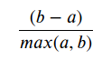

M. Sc. Liliana Millán Núñez liliana.millan@itam.mx

Febrero 2021

## EDA

### Agenda

+ Qué es EDA
+ Tipos de EDA
+ EDA
+ GEDA
  + Reglas de visualización

#### EDA

+ Acrónimo de *Exploratory Data Analysis*.
+ Es una parte del proceso de análisis de datos **muy** importante, pues nos permite conocer y entender los datos que queremos analizar.
+ Podrías pensarlo como tu primera aproximación al problema que quieres resolver -primera cita-.
+ Es en esta fase donde realizamos muchas preguntas que queremos contestar con estos datos.
+ Nos permitirá establecer qué es factible de realizar con estos datos, conocer la granularidad de los mismos, las preguntas que se pueden resolver, etc.

##### Objetivo

+ Detectar errores en los datos, en los procesos que generan estos datos, en los procesos para obtener estos datos.
+ Detectar datos anómalos, faltantes.
+ Detectar datos aislados: Solo tenemos datos de lunes a viernes pero no de los fines de semana.
+ Verficar que tenemos datos relevantes y suficientes para contestar las preguntas que queremos contestar.
+ Verificar si la(s) pregunta(s) es la correcta
   + ¿se requiren más datos?
+ ¿Qué otras variables podemos obtener de este *set* de datos que nos permitan contestar tu(s) pregunta(s)? $\leftarrow$ lo veremos en *feature extraction / feature selection*
+ Verificar suposiciones que tengamos de los datos.
+ Selección preliminar de los modelos apropiados.
+ Determinar relaciones entre las variables explicativas.
+ Evaluar la dirección y tamaño -aproximado- de las relaciones entre las variables explicativas y la(s) variable(s) de salida -variable *target*-
+ Empezar a visualizar cómo sería la respuesta a la(s) pregunta(s) que quieres contestar con este set de datos

 De manera no estricta, si un análisis de datos no incluye modelado estadístico formal y/o inferencia/predicción entonces el análisis es EDA o estadística descriptiva.

#### Datos relevantes y suficientes

 
Fuente: [DSAPP](http://dsapp.uchicago.edu/)

Ejemplos:

Objetivo: Queremos predecir la calidad del aire del día de mañana en la Ciudad de México.

+ Datos irrelevantes e insuficientes: Tenemos las mediciones diarias de calidad de aire de estaciones de monitoreo de Culiacán del mes pasado.
+ Datos relevantes pero insuficientes: Tenemos las mediciones diarias de calidad de aire de estaciones de monitoreo de Ciudad de México de abril del 2000.
+ Datos relevantes y suficientes: Tenemos las mediciones diarias de calidad de aire de estaciones de monitoreo de la Ciudad de México desde hace 4 años.

 **Caso hipotético:** Estamos en el año 2017, contamos con los datos de la aplicación de UberEats de México -que solo tiene el 20% de los clientes de todo el país desde hace 1 mes (Julio 2017). Hoy, **12 de agosto del 2017** y queremos ocupar estos datos para predecir el porcentaje de chilangos que querrán comer chiles en nogada en la primer semana de septiembre para poder preparar ofertas y alertar a los comercios con la posible demanda a cubrir ... **únicamente** con estos datos, ¿en qué situación de datos relevantes-suficientes estamos?

### Tipos de EDA

Hay 2 grandes maneras cruzadas de clasificar el tipo de EDA:

1. Hacerlo de manera gŕafica o no -GEDA Graphical Exploratory Data Analysis, EDA Exploratory Data Analysis-
2. Cada método es univariado o multivariado -nonrmalmente bivariada-

+ **Análisis exploratorio no gráfico:** Generalmente incluye calcular el resúmen estadístico de
+ **Análisis exploratorio gráfico:** Resúmen los datos de forma gráfica
+ **Univariada:** Analizan una variable a la vez
+ **Multivariada:** Analizan 2 o más variables a la vez para explorar relaciones entre variables -normalmente bivariada-

 Se recomienda primero hacer un EDA univariado a cada variable que forme parte de un EDA multivariado ANTES de hacer el EDA multivariado

Después de clasificar en estos 4 tipos cruzados existen más divisiones al EDA basadas en:

a. El **rol de la variable**: salida o explicativa

b. El **tipo de la variable**: categórica o numérica

### EDA

Como parte del proceso de EDA tenemos que limpiar los nombres de las columnas:

+ Deben estar en minúsculas
+ Deben estar sin espacios (cambiar por guión bajo)
+ Si hay más de dos palabras, debe estar separados por guión bajo
+ No deben llevar acentos o signos de puntuación (cambiar por guión bajo)

En esta parte generaremos 2 tipos de análisis:

1. *Data Profiling*

Aquí queremos hacer estadística descriptiva básica, depende del tipo de dato que tengas lo que necesitarás obtener como estadística descriptiva básica.

+ Fechas
  + Fecha inicio
  + Fecha fin
  + Huecos en las fechas: sólo tenemos datos entre semana, etc.
  + Formatos de fecha (YYYY-MM-DD)
  + Tipo de dato: `date`, `time`, `timestamp`
  + Número de faltantes (NA)
  + Número de observaciones

+ Categóricos
  + Número de categorías únicas
  + Categorías únicas\* cuidado que algunas veces puedes tener cientos, miles e incluso millones!
  + Número de faltantes (NA)
  + Moda
  + Número de observaciones totales
  + Top 5 de valores repetidas

+ Numéricas
  + Valor mínimo
  + Valor máximo
  + Valor promedio
  + Desviación estándar
  + Cuartil 25%
  + Valor de la mediana
  + Cuartil 75%
  + Número de observaciones totales
  + Número de observaciones únicas
  + Número de valores faltantes (NA)
  + Top 5 de valores repetidos

+ Texto
  + Longitud máxima
  + Encoding
  + Longitud mínima
  + Longitud promedio

2. Estadística descriptiva no generada en el *data profiling*. Dependerá de tu *set* de datos.

+ Correlación
+ Covarianza
+ Curtosis: Qué tan punteaguda es la distribución
+ *Skewness*: Simetría en la distribución
  + Positiva: cola pesada a la derecha
  + Negativa: cola pesada a la izquierda
  + Cercana a cero: Casi simétrica

 Ir a notebook `eda.ipynb`

 Librería *Pandas profiling*

+ Esta librería nos permite hacer el *data profiling* de forma menos talachuda.
+ Puedes instalarla con `pip install pandas-profiling[notebook,html]`
+ Esta librería te generará un reporte con el *data profiling* de tus datos.
+ Solo hay que tener cuidado porque esta librería **no** verificará si los tipos de datos son correctos o no, y conforma al tipo de dato realizará el *profiling* pertinente.
+ Esta librería hace la combinación de *data profiling* con GEDA.

### GEDA o GDA

+ Acrónimo de *Graphical Exploratory Data Analysis* o *Graphical Data Analysis*
+ Aquí queremos sintetizar hallazgos de nuestro análisis a través de gráficas
+ Las gráficas deben ser claras, explícitas e idealmente sin necesidad de agregar texto para explicar lo que queremos mostrar (sin ambigüedad).

#### Reglas de visualización

+ No existe la gráfica perfecta para cada tipo de variable, dependerá de tu set de datos y el contexto en el que estos datos suceden, sin embargo, si hay reglas básicas de visualización que debes seguir.

+ Dado que no hay una gráfica perfecta es necesario probar con varios tipos de gráficas -que cumplan con las reglas de visualización- para identificar cuál muestra la información de la mejor manera.

+ Una gráfica debe ser explícita y **sin** posibilidad de ambigüedad en la información presentada -> Recuerda que la mayoría de tomadores de decisiones solo ven una gráfica...

+ Tus gráficas siempre deben tener etiquetas que indiquen qué es el eje `x` y qué es el eje `y`, así como un título de lo que estás graficando.

+ Si alguno de tus ejes tiene cifras con más de 3 dígitos, siempre incluye comas (50,000) y si es necesario sintetiza las cantidades para facilitar la lectura (50k).

+ Incluye las unidades en las que se encuentra cada eje (`$`, `ml`, etc).

+ Variables que suceden en el tiempo: Si quieres mostrar algo que sucede en el tiempo, es necesario que ocupes por cada observación un punto y una línea que los ligue, por lo tanto tu eje `x` debe ser el tiempo! [Connect your dot](https://www.data-to-viz.com/caveat/connect_your_dot.html)

+ Si tus datos son categóricos y **no** requieres de poner una leyenda, entonces no es necesario que ocupes diferentes colores por categoría.

+ Proporciones: **Nunca** ocupes gráficas de *pie*, el ojo humano no distingue correctamente proporciones utilizando ángulos!. [The issue with the pie chart](https://www.data-to-viz.com/caveat/pie.html). En lugar de ocupar *pies* ocupa barras horizontales ordenadas de mayor a menor! de esta manera siempre es explícito quién es el de mayor proporción y por cuánto.  

**Si me entregas una gráfica de pie en cualquier tarea, ¡tu tarea tiene 0!**

En lugar de hacerlo asi:

 

Mejor poner la información así:

 

Ejemplos de visualizciones mal utilizadas (╯°□°)╯︵ ┻━┻:

 
Fuente: [flowingdata.com](https://flowingdata.com/2009/11/26/fox-news-makes-the-best-pie-chart-ever/)

 
Fuente: [flowingdata.com](https://flowingdata.com/2010/05/14/wait-something-isnt-right-here/)

 
Fuente: [flowingdata.com](https://flowingdata.com/2012/11/09/incredibly-divided-nation-in-a-map/)

**Variables numéricas**

+ **Histograma**: Simetría/Asimetría, huecos, multimodalidad, aproximación a una distribución **empírica**. Una variable (numérica o categórica).
+ **Diagrama de caja y brazos** -boxplot-: outliers, amontonamientos. Cuartiles 25%, 50%, 75%.
+ **Scatterplot**: Cada dato es un punto, permite identificar huecos. Dos variables numéricas. Identificar relación (co) entre variables por ejemplo explicativa y output.
* **Rugplot**: Gráfica que agrega pequeñas líneas verticales (eje x) u horizontales (eje y), se ocupa como un extra a un scatterplot.
+ **Density estimate**: Como un modelo de tus datos... solo ten cuidado con los límites de las variables.
+ **Distribution estimate**: Permite comparar distribuciones como por ejemplo si una está adelante de otra.
+ **QQ-plot**: Permite comparar dos distribuciones, la tuya vs una teórica (por default la normal).
+ **Matriz de correlación**: Permite identificar correlaciones entre variables.  

**Histogramas**

¿Qué información podemos obtener del siguiente histograma?

 
Fuente: [Graphical Data Analysis with R](https://www.crcpress.com/downloads/K25332/Chapter_1.pdf)

 
Fuente: [Graphical Data Analysis with R](https://www.crcpress.com/downloads/K25332/Chapter_1.pdf)

 La información obtenida de cada gráfica requerirá que pruebes con diferentes variables y configuraciones -tamaños de bines, etc.-, explora todas estas opciones para llegar a la información adecuada. ¡No te apresures en tus conclusiones!

Tenemos los datos de admisiones a [UC Berkeley en 1973](http://www-eio.upc.edu/~pau/cms/rdata/datasets.html), queremos saber si en la admisión hay un sesgo por género.

 
Fuente: [Graphical Data Analysis with R](https://www.crcpress.com/downloads/K25332/Chapter_1.pdf)

 
Fuente: [Graphical Data Analysis with R](https://www.crcpress.com/downloads/K25332/Chapter_1.pdf)

Datos de los [precios de casas en Boston USA](http://www-eio.upc.edu/~pau/cms/rdata/datasets.html).

 

 

 

 

 

**Nota:** Se utilizan colores secuenciales (degradados) cuando utilizamos variables numéricas que están relacionadas a una disminución o aumento -heatmaps-, se utilizan colores divergentes cuando utilizamos variables categóricas.

**Boxplots**

Con los datos de [diabetes de la India](https://archive.ics.uci.edu/ml/datasets/diabetes) de la librería de UCI de machine learning.

¿Qué información podemos obtener del siguiente *boxplot*? Se muestran las 6 variables numéricas del set.

 

 

**Scatterplot**

¿Qué información podemos obtener del siguiente *scatterplot*?

Datos Iris:

 

Datos Boston:

 

**Matriz de correlación**

¿Qué información podemos obtener de la siguiente gráfica de correlaciones?

Datos Boston:

 

**Variables categóricas**

+ **Barplot:** Nos permite identificar categorías extra, errores, faltantes, distribución.
+ **Stripplot:** Nos permite graficar un *scatterplot* con una variable categórica y una numérica.
+ **Doubledecker:** Permite visualizar una regla de clasificación. Tablas de contingencia.

**Barplot**

Datos UC Berkeley

 

O

 

 

**Stripplot**

Por default tiene *jitter* para que se vean mejor las observaciones.

 

 

**Doubledecker**

Datos de admisiones de UC Berkeley.

 
Fuente: [Graphical Data Analysis with R](https://www.crcpress.com/downloads/K25332/Chapter_1.pdf)

### Referencias

+ [Data to Viz](https://www.data-to-viz.com/caveats.html)
+ [Graphical Data Analysis wiht R](https://www.amazon.com/Graphical-Data-Analysis-Chapman-Hall/dp/1498715230)
+ [The worst chart in the world](https://www.businessinsider.com/pie-charts-are-the-worst-2013-6)
+ [Tutorial Seaborn](https://seaborn.pydata.org/tutorial.html)
+ [Página de Seaborn](https://seaborn.pydata.org/index.html)
+ [Seaborn API](https://seaborn.pydata.org/api.html)
+ [Librería Pandas Profiling](https://github.com/pandas-profiling/pandas-profiling)

M. Sc. Liliana Millán Núñez liliana.millan@itam.mx

Febrero 2021

## Introduccion a Machine Learning

### Agenda

+ *Machine Learning*
+ *Business intelligence* vs ML
+ Tipos de aprendizaje

### Machine Learning

 

 
Fuente: [Oracle Data Science Blog](https://blogs.oracle.com/datascience/types-of-machine-learning-and-top-10-algorithms-everyone-should-know-v2)

### Business Intelligence vs ML

 
Fuente: [Data Science Central Blog](https://www.datasciencecentral.com/profiles/blogs/updated-difference-between-business-intelligence-and-data-science)

#### Business Intelligence

+ Las preguntas están muy bien definidas (*scoping*)
+ Las preguntas siempre vienen de gerentes, directivos y CxOs
+ Análsis descriptivo
+ Análisis post-mortem, una vez que ya sucedió
+ Siempre se genera un reporte con visualización
  + En un pdf enviado por mail a personas específicas
  + En un *dashboard*
+ Generan cubos, trabajan con cubos

#### ML

+ Predictivo
+ Nos interesa ser preventivos más que reactivos
+ Inclusive se puede hacer análisis causal
+ Las preguntas vienen más de quien analiza los datos, aunque todas están bajo el contexto de un problema particular de la empresa
+ Datos estructurados y no estructurados
+ Datos de cualquier "tamaño" y dimensión
+ Los algoritmos de ML responden **1 sola** respuesta a la vez!, si se requiere de responder varias preguntas, cada una tendrá su propio algoritmo de ML (es posible conectarlas ocupando la predicción de un algoritmo como variable de entrada de otro)

 En minería de datos y ciencia de datos, **correlación no implica causalidad**. Existen modelos específicos de causalidad -y especialidades dedicadas únicamente a eso!-

### Tipos de aprendizaje

#### Aprendizaje supervisado

+ Conocemos la respuesta correcta de antemano.
+ Esta respuesta correcta fue "etiquetada" por un humano (la mayoría de las veces, en algunas circunstancias puede ser generada por otro algoritmo).
+ Debido a que conocemos la respuesta correcta, existen muchas métricas de desempeño del modelo para verificar que nuestro algoritmo está haciendo las cosas "bien".
+ El aprendizaje más sencillo pero más

#### Tipos de algoritmos

**Clasificación**

+ La respuesta correcta es un valor categórico.
+ La variable respuesta -*target*- debe tener más de 2 valores diferentes.
  + Binarias: Si/no, 0/1, False/True, Sube/Baja, Alto/Bajo, etc.
  + Multinomiales: Alto/Medio/Bajo, Si/No/Tal vez, Azul/Rojo/Amarillo/Verde/Morado, 0/1/2/3/4/5.../10, etc.

**Regresión**

+ La respuesta correcta es un valor numérico entero o real.
+ **No** confundir con algoritmos de regresión.

##### Algoritmos de ejemplo

+ Árboles
+ RandomForest
+ SVM
+ Redes neuronales
+ XGBoost
+ Redes neuronales profundas
+ GLM
+ KNN
+ Otros

**Ejemplo clasificación**

Tenemos el siguiente *set* de datos (etiquetado) con el que entrenamos un modelo de clasificación:

 

+ ¿Cuántas categorías tenemos?

Este es nuestro *set* de pruebas, ¿qué predicción darías a cada observación?

 

 ML **no** es 100\% "preciso" (más adelante hablaremos de eso) y **no debe** ser 100\% preciso.

**Ejemplo regresión**

Tenemos el siguiente *set* de datos (etiquetado) con el que entrenamos un modelo de clasificación:

 

+ ¿Cuántas categorías tenemos?

Este es nuestro *set* de pruebas, ¿qué predicción darías a cada observación?

 

#### Aprendizaje no supervisado

+ Aquí no tenemos la respuesta correcta de antemano ¿cómo podemos saber que el algoritmo está bien o mal?
+ Estadísticamente podemos verificar que el algoritmo está bien
+ Siempre tenemos que verificar con el cliente si los resultados que etamos obteniendo tienen sentido de negocio. Por ejemplo, número de grupos y características

#### Tipos de algoritmos

+ **Reducción de dimensionalidad**

En este tipo de algoritmos queremos reducir el número de dimensiones que tenemos -variables- en nuestro *dataset* conservando la mayor cantidad de información posible al hacer esta reducción. $leftarrow$ Más adelante veremos por qué esto es importante.

**Algoritmos**

+ PCA: Variables numéricas
+ CATPCA: Variables categóricas

+ **Agrupación**

En este tipo de algoritmos queremos agrupar los datos que tenemos encontrando patrones que los hacen similares. Cómo definamos similitud será lo que nos permita tener diferentes algoritmos para generar estos grupos.

**Ejemplo**

Tenemos el siguiente *set* de datos:

 

 ¿Cómo podemos agrupar estos datos?

 

 

 

**Algoritmos**

+ K-Means
+ HClust
+ DBScan
+ HDBScan
+ t-SNE
+ ...

+ **Asociación**

En este tipo de algoritmos lo que queremos es encontrar relaciones que suceden juntas con cierta frecuencia en nuestro *dataset*, también conocidos como *Market Basket Analysis*.

Las asociaciones pueden ser desde 2 cosas que suceden al mismo tiempo hasta n cosas.

Este tipo de modelos se aplican en Amazon para recomendar productos que te pueden interesar, lo veremos más adelante.

**Algoritmos**

+ A-priori

**Ejemplo**

Tenemos el siguiente *set de datos*:

 

Existen las siguientes asociaciones en nuestros datos: Asociaciones de 1 elemento, 2 elementos, 3 elementos, etc.

 

Nota que conforme tu número de elementos aumenta en la asociación, necesitas mucho más observaciones para "sostener" esa asociación. $leftarrow$ Veremos esto más adelante.

¿Cuál es la asocación que aparece con mayor frecuencia?

 

#### Aprendizaje por refuezo

+ Se parece más a la forma en la que los humanos aprendemos. Por ejemplo aprender a caminar
+ En este tipo de aprendizaje se utiliza la "experiencia" para aprender
+ Optimizamos una función de costo que incluye recompensas y castigos
+ Se **requiere** de tener historia con diferentes estrategias aplicadas! para tener las recompensas y castigos adecuados
+ Cuando se requieren de recomendar una estrategia, este es el tipo de aprendizaje a utilizar
+ Une diferentes disciplinas: Agentes inteligentes, teoría de juegos.
+ **No** veremos este tipo de aprendizaje en esta clase

M. Sc. Liliana Millán Núñez liliana.millan@itam.mx

Marzo 2021

### **Cross-validation**

#### Agenda

+ *Hold out Validation*
+ *Cross validation*
  + *K-fold*
  + *Leave one out*
  + *Temporal*

****

En ML, para evitar hacer sobreajuste a los modelos, partimos el conjunto de datos de entrenamiento en varios pequeños *sets* que iremos alternando como *set* de pruebas.  

#### Hold out Validation

La forma más sencilla e incorrecta.

 
Fuente: [Data splitting - Include Help](https://www.includehelp.com/ml-ai/data-splitting.aspx)

##### Cross Validation

+ Es un método estadístico que nos permite **evaluar** qué tan bien generaliza un modelo -a través de su desempeño-.
+ Existen muchas variantes, la más común es **k-fold cross validation**.

**K-fold cross validation**

+ Partimos nuestro set de entrenamiento en *k* sets -mínimo 5, normalmente 10-.
+ Apartaremos uno de estos *k* sets para ocuparlo como nuestro *set* de pruebas y el resto *k-1* como entrenamiento.
+ Cambiaremos de *set* de pruebas *k* veces.
+ El desempeño del modelo se toma como el **promedio** del desempeño de las *k* pruebas.
+ La selección de los datos que forman parte de los *k-folds* se escoge de manera aleatoria.

 

 
Fuente: [Cross validation (Statistic) Wikipedia](https://en.wikipedia.org/wiki/Cross-validation_\(statistics\))

**Leave One Out CV**

+ Un extremo del *K-fold CV* consiste en hacer *k* una observación, en este caso tendremos un *k=n* donde *n* es el núnmero de observaciones totales de nuestro *set* de entrenamiento.

 
Fuente: [Cross validation (Statistic) Wikipedia](https://en.wikipedia.org/wiki/Cross-validation_\(statistics\))

#### Temporal Cross Validation

Cuando nuestros datos tienen temporalidad, no podemos hacer el *spliting* en set de entrenamiento y set de pruebas de manera aleatorio, ni **tampoco** podemos ocupar CV normal.

 ¿Por qué?

En estos casos necesitamos respetar el tiempo y la secuencia en la que las observaciones se ocurrieron en la realidad. En este caso nuestro *split* debe ser de acuerdo al tiempo. Por ejemplo: Si contamos con datos de enero 2019 a octubre 2019 podemos partir el set en:

+ Entrenamiento: Enero 2019 a Agosto 2019
+ Pruebas: Septiembre 2019 a Octubre 2019

 ¿Puedes identificar algo "raro"?

Y el **temporal cross validation** debe realizarse sobre el *set* de entrenamiento **respetando** la temporalidad, aquí **no** podemos escoger las observaciones de cada *k-fold* de forma aleatoria. Es decir, un *k* puede ser febrero y entrenamos con enero, luego el siguiente *k* puede ser marzo y entrenamos con enero y febrero, etc.

 
Fuente: [Go Data Driven](https://blog.godatadriven.com/time-series-nested-cv)

Otra configuración puede ser mantener el tamaño de la ventana de entrenamiento del mismo tamaño conforme avanzamos en el CV. Esto hace que las comparaciones entre *fold* sean más equitativas.

 
Fuente: [Uber engineering](https://blog.godatadriven.com/time-series-nested-cv)

M. Sc. Liliana Millán Núñez liliana.millan@itam.mx

Marzo 2021

### *Bias-Variance Tradeoff*

#### Agenda

+ *Underfitting*  
+ *Overfitting*
+ *Model Complexity graph*
+ *Data-Leaking*

***

Consiste en el *tradeoff* al que nos enfrentamos en cada modelo que hacemos para no hacer un sobreajuste -*overfit*- o un subajuste -*underfit*-.

#### *Underfitting*

+ El modelo es demasiado general.
+ Error debido al sesgo -*error due to bias*-.
+ Durante el entrenamiento no tiene un buen desempeño.

 
Fuente: Udacity nanodegree: Deep Learning

 
Fuente: Udacity nanodegree: Deep Learning

#### *Overfitting*

+ El modelo es muy particular.
+ Error debido a la varianza -*error due to variance*-.
+ Durante el entrenamiento tiene un desempeño muy bueno, pero al pasar nuevos datos su desempeño es malo.

 
Fuente: Udacity nanodegree: Deep Learning

 
Fuente: Udacity nanodegree: Deep Learning

#### *Model complexity graph*

Un buen modelo no es ni muy general ni muy especializado, se comporta bien en el entrenamiento, en los *sets* de validación -*cross validation* y en el *set* de pruebas.

Podemos ocupar una gráfica de complejidad de modelo -*model complexity graph*- en donde comparamos los errores obtenidos en el entrenamiento con los errores obtenidos en el *cross validation* para ver en qué espectro del *tradeoff* nos encontramos para el modelo que estamos construyendo. En el eje de las `y` pondremos los errores obtenidos para el entrenamiento y validación -una línea por cada uno- y en el eje de las `x` cada modelo entrenado de menor a mayor complejidad\*.

 
Fuente: Udacity nanodegree: Deep Learning

 
Fuente: Udacity nanodegree: Deep Learning

 
Fuente: Udacity nanodegree: Deep Learning

M. Sc. Liliana Millán Núñez liliana.millan@itam.mx

Marzo 2021

## Clasificación

### Agenda

+ Clasificación
+ Métricas de Desempeño

----
###  Clasificación

#### Procedimiento

#### Métricas de desempeño

Debido a que contamos con la respuesta correcta podemos contar cuántos aciertos tuvimos y cuántos fallos tuvimos.

Por simplicidad ocuparemos un ejemplo de clasificación binaria: Fraude (1) o No fraude (0).

En este tipo de algoritmos definimos cuál de las categorías será nuestra etiqueta positiva y cuál será la negativa. La positiva será la categoría que queremos predecir -en nuestro ejemplo, fraude- y la negativa lo opuesto -en el caso binario- en nuestro ejemplo, no fraude.

Dadas estas definiciones tenemos 4 posibilidades de *outcome*:

1. **True positives:** Nuestra predicción dijo que la transacción es fraude y la etiqueta real dice que es fradue.
2. **False positives:** Nuestra predicción dijo que la transacción es fraude y la etiqueta real dice que no es fraude.
3. **True negatives:** Nuestra predicción dijo que la transacción es no fraude y la etiqueta real dice que no es fraude.
4. **False negatvies:** Nuestra predicción dijo que la transacción es no fraude y la etiqueta real dice que es fraude.

##### AUC y ROC:

*Area Under the Curve* y *Receiver operator characteristic*

 

 

 

 

##### Matriz de confusión

Esta métrica corresponde a una matriz en donde se plasma el conteo de los aciertos y los errores que haya hecho el modelo.

En esta métrica utilizamos todos los aciertos y todos los errores que haya tenido el modelo en las predicciones, esto es: los verdaderos positivos (TP), los verdaderos negativos (TN), los falsos positivos (FP) y los falsos negativos (FN).

El nombre de la métrica está asociado a que puede ser confuso leer e interpretar correctamente la información que nos presenta.

Normalmente los renglones representan las etiquetas reales, ya sean positivas o negativas, y las columnas, las etiquetas predichas.

No te preocupes si es algo confuso en este momento, veremos cada elemento por separado para que queden claros los elementos y cómo leerlos.

 

Puedes ver en la siguiente matriz, que la primera columna tiene el nombre Real, y que, el primer renglón dice “Etiquetas positivas”, y el segundo renglón dice “Etiquetas negativas”.

 

La primera columna tiene el nombre “Predicción”, y la segunda columna dice “Etiqueta positivas”, y que la segunda columna dice “Etiqueta negativas”.

 

Cada celda en la matriz incluye la información correspondiente a las etiquetas reales y a las etiquetas predichas por el modelo.

En la celda donde las etiquetas reales son positivas y las etiquetas predichas son positivas se encuentra el conteo de los verdaderos positivos del modelo. Esto es, el número de observaciones en donde el modelo dio una predicción de etiqueta positiva y efectivamente la etiqueta real era positiva.

De la misma manera siguiendo esta diagonal, la celda donde las etiquetas reales son negativas y las etiquetas predichas son negativas se encuentra el conteo de los verdaderos negativos del modelo. Esto es, el número de observaciones en donde el modelo dio una predicción de etiqueta negativa y efectivamente la etiqueta real era negativa.

En la diagonal de la matriz de confusión siempre se encuentran los aciertos del modelo, tanto los verdaderos positivos como los verdaderos negativos.

 

Ahora, moviéndonos a la celda en donde las etiquetas reales son negativas y las predicciones del modelo son etiquetas positivas, encontramos los falsos positivos. Esto es, el número de observaciones en donde el modelo dio una predicción de etiqueta positiva pero la etiqueta real era una etiqueta negativa.

 

Por último, la celda en donde las etiquetas reales son positivas y las predicciones del modelo son etiquetas negativas, encontramos los falsos negativos. Esto es, el número de observaciones en donde el modelo dio una predicción de etiqueta negativa pero la etiqueta real era una etiqueta positiva.

Veamos un ejemplo de cómo leer una matriz de confusión.

 

En la siguiente matriz de confusión se puede ver:

+ Que el modelo tiene 125 aciertos en verdaderos positivos, esto es, observaciones cuya etiqueta real era positiva y el modelo predijo correctamente con etiqueta positiva.
+ Que el modelo tiene 233 aciertos en verdaderos negativos, esto es, observaciones cuya etiqueta real era negativa y el modelo predijo correctamente con etiqueta negativa.
+ Que el modelo tiene 46 falsos positivos, esto es, observaciones cuya etiqueta real era negativa y el modelo predijo erróneamente con etiqueta positiva.
+ Que el modelo tiene 20 falsos negativos, esto es, observaciones cuya etiqueta real era positiva y el modelo predijo erróneamente con etiqueta negativa.
+ Que el modelo tiene 358 aciertos totales, entre verdaderos positivos y verdaderos negativos.
+ Que el modelo tiene 66 errores totales de predicción, entre falsos positivos y falsos negativos.
+ Que el modelo tiene un mejor desempeño para predecir la etiqueta negativa que la positiva.
+ Que el modelo comete menos errores en las etiquetas negativas.

 

También es posible que una matriz de confusión tenga las columnas como las etiquetas reales y los renglones como las etiquetas predichas por el modelo.

En este caso lo único que cambia es que los falsos negativos y los falsos negativos intercambian lugares. Esto es, ahora debajo de los verdaderos positivos están los falsos negativos, y junto a los verdaderos positivos están los falsos positivos.

Claro que también puedes invertir el orden de las etiquetas y poner primero las negativas y luego las positivas.

Lo más importante será que la matriz de confusión siempre tenga los títulos de qué es predicho y que es la etiqueta real para poder interpretar correctamente los valores que se presentan en ella.

 

 ¿Cuándo utilizar la matriz de confusión?

Siempre deberás de obtener tu matriz de confusión para el punto de corte que selecciones en la métrica de desempeño de curva ROC, que vermos más adelante.

Toma en cuenta que es necesario agregar esta métrica en la entrega de tu modelo.

 
Fuente: [Scikit learn Confusion Matrix](https://scikit-learn.org/stable/modules/model_evaluation.html#confusion-matrix)

 
Fuente: [Scikit yellowbrick](https://www.scikit-yb.org/en/latest/api/classifier/confusion_matrix.html)

#### *Accuracy*

Número de aciertos totales entre todas las predicciones.

 

+ La métrica más socorrida -malamente-
+ En *datasets* imbalanceados esta métrica no nos sirve, al contrario, nos engaña. Por ejemplo: Fraude con tarjeta de crédito.

##### *Precision* :: Eficiencia

De los que identificamos como clase positiva, cuántos identificamos correctamente. ¿Qué tan eficientes somos en la predicción?

 

##### *Recall* :: Cobertura

Del universo posible de nuestra clase positiva, cuántos identificamos correctamente.

*Precision* y *Recall*

 

El precision medirá la eficiencia del modelo en la predicción de las etiquetas positivas, en este caso los círculos azules. En este caso, los 3 círculos amarillos con contorno negro corresponden a los falsos positivos, observaciones que fueron predichas como etiqueta positiva pero que en realidad eran etiqueta negativa. Para obtener el precision de este modelo, necesitamos contar los círculos azules y dividirlos entre la suma de los círculos azules y los círculos amarillos con contorno azul -predichos como azul, pero en realidad eran amarillos-.

Por otro lado, el recall medirá la cobertura de nuestro modelo, es decir, qué tantos círculos azules de todos los posibles círculos azules el modelo predijo correctamente. En este caso, los 4 círculos azules con contorno amarillo corresponden a falsos negativos, observaciones que fueron predichas como etiqueta negativa pero realmente eran etiqueta positiva. Para obtener el recall de este modelo, necesitamos contar los círculos azules y dividirlos entre la suma de los círculos azules y los círculos azules con contorno amarillo -predichos como amarillos, pero en realidad eran azules-.

En este caso en particular, tenemos una mejor eficiencia o precision que cobertura o recall , de 0.77 y 0.71 respectivamente. Esto significa que el modelo se equivoca poco cuando predice que una observación es etiqueta positiva, pero que sin embargo, se le escapan algunas etiquetas positivas y las predice como negativas -menor recall-.

 ¿Cuándo utilizar precision?

Esta es la métrica que ocuparás más, pues en un contexto de negocio, donde los recursos son finitos y tiene un costo asociado, ya sea monetario o de tiempo o de recursos, necesitarás que las predicciones de tu etiqueta positiva sean muy eficientes.

Al utilizar esta métrica estaremos optimizando el modelo para minimizar el número de falsos positivos.

 ¿Cuándo utilizar recall?

Esta métrica la ocuparás cuando en el contexto de negocio de tu problema sea más conveniente minimizar los falsos negativos por el impacto que estos pueden tener en las personas en quienes se implementará la predicción. Por ejemplo, predecir si se tiene cáncer o no al ver una imágen de resonancia magnética. En este modelo quisiéramos optimizar para que cuando decimos que la mayoría de los casos que haya cáncer el modelo haga una predicción de etiqueta positiva, y que se nos escapen la menor cantidad de casos, ya que por cada error al decir que no se tiene cáncer estamos negando a una persona un tratamiento que pueda curar su cáncer, lo que puede llevar a matar a alguien al equivocarnos diciendo que no tenía cáncer cuando sí lo tenía.   

Al utilizar esta métrica estaremos optimizando el modelo para minimizar el número de falsos negativos.

#### *Precision Recall curve*

 
Fuente: [Scikit-learn](https://scikit-learn.org/stable/auto_examples/model_selection/plot_precision_recall.html#sphx-glr-auto-examples-model-selection-plot-precision-recall-py)

 
Fuente: Kasun Amarasinghe

#### **F1-score:**

Combina *precision* y *recall* para optimizar ambos.

 

 ¿Cuándo utilizar la métrica f1-score?

Se recomienda utilizar esta métrica de desempeño cuando quieres balancear tanto los falsos positivos como los falsos negativos. Aunque es una buena solución para tomar en cuenta ambos errores, pocas veces hay problemas reales que permiten ocuparla, esto es porque en más del 90% de los casos tenemos una restricción en recursos.

M. Sc. Liliana Millán Núñez liliana.millan@itam.mx

Marzo 2021

### Agenda

+ Introducción
+ Algoritmo
+ Ejemplo a mano
+ Ejemplo `sklearn`

***
#### Introducción

Los árboles en clasificación tienen el objetivo de predecir una variable categórica -normalmente binaria-.

En clasificación, la forma en la que en un árbol se decide cómo se separan mejor los datos es a través de la entropía. Esta métrica mide qué tanta impureza hay en un nodo, donde la impureza tiene que ver con que los datos sean heterogéneos.

La entropía es una métrica que va entre 0 y 1 `[0,1]`, donde un valor de 0 corresponde a que todos los elementos en ese nodo son homogéneos, es decir, son iguales. En el contexto de clasificación, que sean iguales significa que todos tienen la misma categoría de la variable que queremos predecir, por lo que si por ejemplo, queremos predecir si una transacción bancaria es fraude o no, y en un nodo únicamente tenemos transacciones que son fraude, ese nodo tendrá una entropía 0 es decir, todos los datos son homogéneos.

Por otro lado, una entropía de 1, indica que los datos son heterogéneos, por lo que un nodo con entropía 1, indicaría que tenemos transacciones de fraude y de no fraude.

Para calcular la entropía de una variable binaria ocupamos la ecuación 1 que se muestra a continuación. En donde la variable se define como un experimento bernoulli donde *p* es la probabilidad de éxito, y *q* la probabilidad de fallo.

Figura 3

Para calcular la entropía de la variable *target* con respecto a una variable explicativa se ocupa la ecuación 2, en donde `ValoresA` se refiere a todos los posibles valores que puede tomar una variable explicativa categórica, y `V` se refiere a un valor específico de esa variable explicativa, por lo que `P(V)` se refiere a la probabilidad del valor `V` del atributo `A`.

Por último, para calcular la ganancia de información utilizando la entropía, se ocupa la ecuación 3, en donde restamos a la entropía de la variable *target* la entropía de la variable *target* causada por separarla utilizando la variable explicativa `A`.

#### Algoritmo

1. Obtener la entropía de la variable a clasificar —*target*—
2. Obtener la entropía de la variable a clasificar con respecto a una variable predictora
3. Obtener la ganancia de la variable seleccionada en el paso anterior
4. Repetir el paso 2 y 3 por cada variable predictora
5. Seleccionar la variable con mayor ganancia de información como el nodo raíz/decisión
6. Repetir los pasos 2 y 3 para el resto de las observaciones y variables cuya entropía es mayor a 0 hasta que la entropía sea 0 o bien, no haya más observaciones para dividir.
  + Si la entropía es `0`, se trata de una hoja —todos los datos son homogéneos, no hay impureza—
  + Si la entropía es `>0` aún se debe seguir dividiendo el *set*.

La condición de paro de este algoritmo consiste en que todas las variables logren tener una entropía de 0 o bien, que ya no haya más observaciones para poder seguir dividiendo.

Los nodos hoja necesariamente tendrán que surgir por alguna de estas dos condiciones.

#### Hiperparámetros

+ Profundidad del árbol
+ Número de elementos necesarios para seguir dividiendo
+ La métrica en la que se cuantifica la ganancia de información: Gini -índice de desigualdad- y Entropía. Por default la mayoría de los algoritmos ocupan gini.

La sugerencia es que evites definir la profundidad del árbol, pues de esta manera estas restringiendo el crecimiento orgánico\*, se prefiere mejor definir el número de elementos que debe haber mínimo en un nodo para poder seguirse dividiendo. Si dejas que el árbol crezca sin limitar la profundidad es muy probable que hagas un modelo sobre ajustado, y por otro lado, si limitas la profundidad a ser muy pequeña, es muy probable que sub ajustes el modelo por lo que no generalizará correctamente los patrones en los datos.

Cuando ajustamos el crecimiento del árbol ya sea a través de definir la profundidad máxima o a través de definir el número de elementos mínimos para seguir dividiendo los datos estamos podando nuestro árbol o haciendo *pruning*.

#### Ejemplo manual

Tenemos los datos que se muestra en la Tabla 1,  con los que queremos predecir si dada la temperatura y la humedad del día jugaremos golf o no.

Este problema es un problema de aprendizaje supervisado de clasificación, donde la variable *target* es si `jugar golf` o `no jugar golf`, siendo la etiqueta positiva la etiqueta `jugar golf`, y la variable negativa la etiqueta `no jugar golf`.

Contamos con 10 observaciones en nuestro conjunto de datos para aprender los patrones entre la temperatura y la humedad para decidir si jugar golf o no.

 
Tabla 1. Datos de ejemplo.

Iniciamos calculando la entropía de la variable *target*.

Formulando nuestra variable *target* como una variable bernoulli, nuestro éxito corresponde a jugar golf, y el fracaso a no jugar golf.

La probabilidad de jugar golf consiste en contar la frecuencia de jugar golf entre el número de observaciones totales de nuestro conjunto de datos, esto es 6 de 10 observaciones.  Mientras que la probabilidad de no jugar golf es de 4 de 10 observaciones.

 
Figura 4. Paso 1. Cálculo de entropía de la variable *target*.

El siguiente paso consiste en obtener la entropía de nuestra variable *target* con respecto a una variable explicativa, no importa cual, pues revisaremos todas las variables explicativas. Iniciaremos con la variable `temperatura`.

 La variable `temperatura` tiene 2 valores diferentes: `alta` y `normal`, por lo que calcularemos la entropía para cada valor.

Para cuando la `temperatura` es `alta`, existen 5 observaciones, de las cuáles en 2 observaciones `jugamos golf` y en 3 `no`.

 
Figura 5. Cálculo de entropía para la variable `temperatura` con el valor `alta`.

Para cuando la `temperatura` es `normal`, existen 5 observaciones, en las cuales 4 `jugamos golf` y 1 `no`.

 
Figura 6. Cálculo de entropía para la variable `temperatura` con el valor `normal`.

La ganancia de información que obtenemos ocupando la temperatura para clasificar `jugar golf` o `no`.

 
Figura 7. Cálculo de ganancia de información utilizando la variable `temperatura` para clasificar la variable *target*.

Haremos lo mismo que hicimos con la variable explicativa para la siguiente variable explicativa que tenemos, `humedad`.

 La variable `humedad` tiene 2 valores diferentes: `alta` y `normal`, por lo que calcularemos la entropía para cada valor.

Para cuando la `humedad` es `alta`, existen 6 observaciones, de las cuáles en 2 observaciones `jugamos golf` y en 4 `no`.

 
Figura 8. Cálculo de entropía para la variable `humedad` con valor `alta`.

Para cuando la `humedad` es `normal`, hay 4 observaciones de las cuales las 4 están asociadas a `jugar golf`.

Dado que todos los elementos de esta variable ya son iguales, es decir, todos tienen el mismo valor de la variable *target*, su entropía es 0, pues todo los elementos son homogéneos, como se muestra en la Figura 9.

 
Figura 9. Cálculo de entropía de la variable `humedad` con valor `normal`.

Ahora calcularemos la ganancia de información como se muestra en la Figura 10.

 
Figura 10. Cálculo de ganancia de información al utilizar la `humedad` como variable para clasificar la variable *target*.

Ahora que ya tenemos la entropía que aporta cada variable explicativa, deberemos seleccionar la que mayor ganancia de información tiene. En este caso, la `humedad`, por lo que esta variable se convierte en nuestro nodo raíz.

Dado que la `humedad` puede tomar dos valores, `normal` o `alta`, se generan dos nodos debajo del nodo raíz, uno para cuando la humedad es `normal`, y otro para cuando la `humedad` es `alta`.

También sabemos que en todos los casos en los que la `humedad` es `normal` la variable *target* toma el valor `jugar golf`, por lo que sabemos que su entropía es 0 y que todas las veces que la `humedad` sea `normal`, predicción será `jugar golf`. El árbol que generamos se puede ver en la Figura 11.

 
Figura 11. Selección de nodo y primer nivel.

Ahora calcularemos la entropía con el resto de las observaciones, esto es, cuando la `humedad` es `alta`.

Ahora el nuevo subconjunto de observaciones sobre las que realizaremos los cálculos de entropía serán sobre aquellas cuya `humedad` sea `alta` como se muestra en la Tabla 2.

Tabla 2. Subconjunto de datos.

Regresamos al paso 2 para calcular la entropía con el resto de las variables explicativas con el nuevo subconjunto de observaciones, por lo que calcularemos la entropía con la `temperatura`.

Cuando la `temperatura` es `alta`, tenemos 3 observaciones, sin embargo, en todas las observaciones la variable *target* toma el valor de `no jugar golf`, por lo que al calcular la entropía, ésta se vuelve 0, porque todos los elementos de este subconjunto son homogéneos, es decir, tienen el mismo valor.

 
Figura 12. Cálculo de entropía con la variable `temperatura` y valor `alta`.

Dado que ya no tenemos más variables explicativas para verificar, podemos parar el algoritmo y ver el árbol generado que se muestra en la Figura 13.

 
Figura 13. Árbol generado.

Cuando la `humedad` es `normal`, el árbol regresará como predicción `jugar golf`.

Si la `humedad` es `alta`, verificamos qué valor tiene la `temperatura`, si ésta es `alta`, el árbol regresará como predicción `no jugar golf`.

Por último, si la `humedad` es `alta`, y el valor de la `temperatura` es `normal` el árbol regresará como predicción `jugar golf`. La razón asociada a esta predicción es porque en el último paso que ejecutamos, en dos de las tres observaciones que tenían `temperatura` `normal`, la etiqueta *target* tenía el valor `jugar golf`.

**Ventajas**

+ Es muy fácil de implementar e interpretar.
+ Se pueden ocupar tanto variables explicativas numéricas como variables explicativas categóricas.
+ Se pueden visualizar las reglas del árbol.

**Desventajas**

+ Dependiendo de qué variables explicativas incluyas en tu modelo, el árbol puede dar resultados muy diferentes.
+ Es fácil sobre ajustar el modelo al dejarlo crecer en profundidad sin hacer *pruning*.
+ Definir los hiperparámetros para la profundidad y el número de elementos que un nodo debe tener para ser considerado hoja, dependen de la experiencia del que desarrolla el modelo y del problema en particular.

Ahora veremos cómo implementar un árbol en `scikit-learn`.

 Ir a notebook `classification_trees.ipynb`.

M. Sc. Liliana Millán Núñez liliana.millan@itam.mx

Abril 2021

### Random Forest

### Agenda

+ Modelos de Ensamble
  + Bagging
  + Boosting
+ Maldición de la dimensionalidad
+ Random Forest
    + Ventajas y desventajas
    + Algoritmo
+ Ejemplo

### Modelos de ensamble

Son aquellos en los que ocupamos **diversos** modelos para combinarlos y formar uno más fuerte. La diversidad es muy importante ya que permite que cada modelo vea un aspecto diferente de los mismos datos y baje la varianza. La diversidad puede venir de tener un mismo experimento diferentes datos de entrenamiento y pruebas, diferentes experimentos con el mismo algoritmo -modificando los hiperparámetros del modelo-, o bien, diferentes algoritmos :).

+ *Bagging (bootstrap aggregating)*: Tomamos diferentes muestras aleatorias de los datos CON reemplazo, suponemos que las diferencias en las muestras generadas con *bootstrap* llevaran a tener modelos diferentes, la  predicción final se obtiene combinando el resultado de todos los modelos creados. Por otro lado, para seguir fomentando diversidad se seleccionan aleatoriamente las variables que forman parte de cada modelo —*subspace sampling*—. Ejemplo de este método de ensamble son los Random Forest.

+ *Boosting*: Otro método de ensamble, aquí se hacen muestras aleatorias de los datos SIN reemplazo formando modelos *débiles* secuenciales con cada muestra, por cada modelo generado se ocupan los errores del anterior para mejorar la salida. Ejemplo de este método de ensamble es AdaBoost.

 

 
Fuente: [Rober E. Schapire](http://rob.schapire.net/papers/explaining-adaboost.pdf)

$\rightarrow$ En humano: Se ocupa una función de costo exponencial a través de la cual establecemos un costo a las clasificaciones incorrectas, cada vez que se genera un nuevo modelo el peso de los mal clasificados se vuelve más grande que los clasificados correctamente.

### Maldición de la dimensionalidad

Conforme más variables tenemos en un *set* de datos más observaciones se requieren para poder tener un número significativo de ejemplos con todas las combinaciones posibles. Esto resulta casi imposible, pues conforme se agregan variables el número de ejemplos requeridos crece exponencialmente. Si no se tienen los ejemplos suficientes, se corre el riesgo de que el modelo generado esté sobre entrenado -*overfitted*-.

 
Fuente [Haifeng Li](https://haifengl.wordpress.com/2016/02/29/there-is-no-big-data-in-machine-learning/)

 

Normalmente en un problema de minería de datos/ciencia de datos ocurre que hay muchas variables a tomar en cuenta para armar un modelo final que nos ayude a resolver el problema de negocio específico. Si bien, es posible incluir todas las variables en los modelos (aunque la mayoría de las veces no resulta tan adecuado por la maldición de la dimensionalidad), también es posible identificar las variables que más información nos dan antes de incluirlas en el modelo final, al igual que es posible generar nuevas variables derivadas de los datos originales que guardan la información más relevante al problema.

La primera opción —identificar variables que más información aportan— es conocida como *feature selection*, la segunda opción —generar nuevas variables derivadas de los datos originales— se le conoce como *feature extraction*. Ambas opciones forman parte del proceso llamado *feature engineering* dentro de un proyecto de ciencia de datos.

+ Algunos métodos de *feature selection*: Árboles, Random Forests, Regresión lineal (con regulariación Lasso).

+ Algunos métodos de *feature extraction*: PCA, SVD, Redes Neuronales Convolucionales (CNN).

### Random Forest

Es un modelo de ensamble creado por [Leo Breiman](https://www.stat.berkeley.edu/~breiman/RandomForests/cc_home.htm#remarks) en donde los diferentes modelos son árboles y son diversos debido a que ocupan *bagging* para su formación. Cuando los *random forests* se ocupan para clasificación se hace un **voto de expertos** —ponderados, mayoría, etc— para el caso de regresión se hace con el promedio —ponderado, simple—.

#### Parámetros

+ Número de árboles en el bosque.
+ Número de variables que habrá en cada árbol
  + La selección de las variables se hace de manera aleatoria para compensar las diferencias que se pueden obtener al poner ciertas variables juntas en un árbol o no.
+ Profundiad de los árboles. Esta definición se respetará para todos los árboles!
+ Número mínimo de elementos en los nodos antes de seguir dividiendo el set de datos -cuántos elementos para ser hoja-.

#### Ventajas y desventajas

+ Al utilizar *bagging* reduce la varianza y evita el *overfitting*
+ Permite hacer selección de variables para construir un segundo modelo utilizando las variables seleccionadas.

#### Métricas de desempeño

Además de las que ya hemos visto con los árboles, en los *random forest* existe la métrica *Out Of Bag (OOB)* que nos brinda información importante.

+ OOB: Corresponde al error promedio de predicción en cada set de entrenamiento $x_i$, medido únicamente con los árboles que **no** tuvieron a estas observaciones en su entrenamiento, como si fueran observaciones nuevas. Es como si estuvieramos haciendo pequeños *sets* de prueba con observaciones que los árboles no vieron durante su entrenamiento. El OOB funciona como un proxy al *accuracy* y toma un valor entre 0 y 1, valores cercanos a 0 indican que no estamos generalizando adecuadamente, mientras que valores muy cercanos a 1 podrían indicar que estamos haciendo *overfitting*.

Debido a que RandomForest utiliza *bagging* como métrica de muestreo para entrenar cada árbol que forma parte del bosque, es posible hacer un tipo de validación cruzada verificando cómo es la predicción de una observación utilizando únicamente árboles en donde esa observación no se utilizó para el entrenamiento.

En cada muestra creada para cada árbol queda alrededor de un 37% de observaciones fuera, de ahí el nombre Out Of Bag, y RandomForest utiliza este 37% como conjunto de validación extra de todos los árboles, de esta manera Out of Bag realiza una especie de validación cruzada propia, y es mejor ocupar esta métrica de desempeño del Random Forest para ver qué tan bien generaliza el modelo.

En la imagen se muestra un conjunto de datos que después se divide en entrenamiento y pruebas, el entrenamiento se encuentra en la parte izquierda, y en el conjunto de pruebas se encuentran aquellas observaciones que no se ocuparon en cada modelo.

 
Fuente: https://medium.com/open-machine-learning-course/open-machine-learning-course-topic-5-ensembles-of-algorithms-and-random-forest-8e05246cbba7

En los RF no necesitamos hacer *cross validation*, ¿por qué?.

En cada árbol construido la muestra generada por *bootstrap* deja fuera 1/3 de los datos, para obtener la métrica de OOB.

 ¿Qué sucede mientras más árboles pones en un Random Forest?

M. Sc. Liliana Millán Núñez liliana.millan@itam.mx

Abril 2021

## KNN

### Agenda

+ KNN
+ Algoritmo
+ Ejemplo

### KNN

Acrónimo de *K-Nearest Neighbours*

Este método al igual que los árboles y los *Random Forest* se puede ocupar tanto para clasificación como para regresión. Pertenece a modelos que aprenden por instancia y eso significa que computacionalmente es muy caro.

KNN no tiene propiamiente una etapa de aprendizaje o entrenamiento, el entrenamiento son las observaciones con las que cuenta al momento de hacer el algoritmo y el aprendizaje sucede con cada observación durante la etapa de predicción.

Es una diferencia cosiderable, pues en los otros algoritmos que habíamos visto tienen una etapa de entrenamiento, que puede llegar a ser tardada y luego una etapa de predicción en donde ya no estamos aprendiendo, solo estamos generando predicciones para las nuevas observaciones.

Este método realiza la predicción basada en lo que opinan los K vecinos más cercanos a esa observación. Sin embargo, surgen algunas preguntas

+ ¿Cercanos a qué?
+ ¿Cómo definimos cercanía?

En KNN definimos **cercanía** calculando la **distancia euclidiana**:

 

Donde:

`x_{q}` es el valor del atributo `r` de la instancia `x_{q}`. La suma se realiza por cada uno de los atributos!

Debido a que necesitamos distancia, requerimos que los atributos que ocupamos para hacer la clasificación sean de **todos** de tipo numérico. Aquellas variables que no sean numéricas deberán convertirse a *One hot encoding*.

### Algoritmo

Entrenamiento:

1. Guardar cada ejemplo del *set* de entrenamiento

Clasificación:

1. Seleccionar el valor de `K` ¿cuántos vecinos cercanos?
2. Calcular la distancia entre la nueva observación y TODAS las observaciones que formaron parte del aprendizaje -> Es esto por lo que es computacionalmente muy caro y lento.
3. Ordenar las distancias calculadas en el paso 2 de menor a mayor y seleccionar los `K` primeros.
4. Identificar la categoría a la que pertenecen los `K` vecinos cercanos.
5. Voto de expertos: la categoría que diga la mayoría de los `K` vecinos es la predicción para la nueva observación.

Aprendizaje:

+ 17 observciones: 10 de tipo a, 7 de tipo b

Clasificación:

Si tenemos `K=3`

¿Cómo quedaría clasificada la nueva observación?

Debido a que hay de los vecinos que agarramos (3) la mayoría son tipo b (2) entonces la nueva observación será de tipo b.

 Hagamos un ejercicio a mano, ir a notebook `knn.ipynb`

### Referencias

+ [KNeighborsClassifier de sklearn](https://scikit-learn.org/stable/modules/generated/sklearn.neighbors.KNeighborsClassifier.html#sklearn.neighbors.KNeighborsClassifier)

M. Sc. Liliana Millán Núñez, liliana.millan@itam.mx

Febrero 2021

## Regresión

### Agenda

+ Regresión
+ Métricas de desempeño

----

### Regresión

En un problema de regresión, la variable target o variable a predecir es un valor numérico.

Dado que lo que queremos predecir es un número, existen 3 posibles escenarios para la predicción:

1. Nuestra predicción fue mayor al número real -*overestimate*-.
2. Nuestra predicción fue menor al número real -*underestimate*-.
3. Nuestra predicción fue igual al número real.

En el primer escenario, el valor predicho por el modelo es más grande que el valor real.

Este caso se llama sobreestimación, pues nuestra predicción quedó larga, es decir, fue mayor al valor real.

 

Dependiendo del problema y el contexto de negocio donde éste se desarrolla, puede ser que una sobreestimación sea más costosa que una subestimación. Cuando hablamos de costo, no solo nos referimos al costo monetario sino de cualquier recurso necesario en las acciones que se requieren de llevar a cabo una vez que se genera una predicción.

En el segundo escenario, el valor predicho por el modelo es más pequeño que el valor real.

Este caso se llama subestimación, pues nuestra predicción quedó corta, es decir, fue menor al valor real.

 

Al igual que con la sobreestimación, dependiendo del problema y el contexto de negocio donde éste se desarrolla, puede ser que una subestimación sea más costosa que una sobreestimación.

En el tercer escenario, la predicción del modelo es exactamente igual al valor real.

En problemas de regresión es muy difícil tener una estimación exacta, ya que la mayoría de las veces los valores a estimar son números reales que incluyen dos, cuatro o hasta seis valores decimales.

 

Dado que al ser un problema de aprendizaje supervisado contamos con un conjunto de datos histórico a través del cual vamos a aprender los patrones que queremos predecir, se sigue un procedimiento particular para ocupar estos datos durante la fase de aprendizaje y generalización de los modelos que desarrollamos.

#### Procedimiento

El procedimiento que veremos a continuación, se ocupa en todos los problemas de aprendizaje supervisado de regresión, sin importar el algoritmo a utilizar.

En los modelos de aprendizaje supervisado siempre contamos con ejemplos de los cuales aprendemos cuál es la respuesta correcta. Esta serie de ejemplos corresponden a transacciones históricas reales que contienen el valor que queremos estimar, a la cual llamamos conjunto de datos.

Para poder entrenar nuestros modelos de regresión, necesitaremos dividir el conjunto de datos histórico en un conjunto de entrenamiento y uno de pruebas.

El conjunto de entrenamiento debe de tener entre un 70% y 80% de las transacciones del conjunto de datos, mientras que el conjunto de pruebas contiene entre el 30% y el 20% de las transacciones del conjunto de datos.

Los datos que forman parte del conjunto de entrenamiento no pueden formar parte del conjunto de pruebas, así como los datos que forman parte del conjunto de pruebas no pueden formar parte del conjunto de entrenamiento.

 

Una vez que tenemos divididos los datos en el conjunto de entrenamiento y pruebas, **deberemos olvidar** que existe un conjunto de datos de pruebas. A partir de este punto para nosotros **no existe** el conjunto de pruebas.

El conjunto de pruebas **no** debe ser ocupado sino hasta que hemos seleccionado el mejor de todos los modelos entrenados, de no hacerlo así, caeremos en el error común de sobre-ajustar -*data leaking*- los modelos al permitirle ver observaciones que no debe conocer.

#### Entrenamiento

Por otro lado, del conjunto de entrenamiento obtendremos varios conjuntos de validación que nos servirán para ir midiendo el desempeño del modelo cuando movemos sus hiper-parámetros.

 

Ahora que ya tenemos un conjunto de entrenamiento y validación, ya podemos iniciar con el entrenamiento de nuestros modelos de regresión.

#### Modelación

Para entrenar nuestros modelos, deberemos ocupar el conjunto de datos de entrenamiento, y para realizar predicciones con las que mediremos el desempeño del modelo utilizaremos el conjunto de validación.

Nunca debemos ocupar el conjunto de datos que utilizamos en la fase de entrenamiento de un modelo como conjunto de datos a predecir para verificar el desempeño del mismo, siempre tienen que ser conjuntos de datos diferentes.

Si el desempeño del modelo no es el adecuado, modificamos los hiper-parámetros del modelo, o agregamos nuevas variables predictoras y volvemos a pasar el conjunto de datos de entrenamiento.

Más adelante veremos métodos de validación cruzada que nos ayudarán a evitar sobre-ajustar el modelo.

 

Con base en el desempeño que tienen los diferentes modelos desarrollados, seleccionamos el que cumple de manera más eficiente con los objetivos del proyecto, tanto operativamente como en las métricas de desempeño específicas.

Una vez que seleccionamos el modelo con el mejor desempeño entonces ocupamos el conjunto de pruebas para obtener los valores de desempeño **finales** del modelo.

 

La única fase donde ocupamos el conjunto de pruebas es cuando queremos obtener las métricas finales del desempeño del modelo.

Si en este punto las métricas de desempeño varían mucho a las obtenidas durante el desarrollo del modelo, entonces hicimos algo mal en la etapa de modelado, ya sea que hayamos sobre ajustado el modelo, o bien no separamos correctamente los conjuntos de datos, o hicimos data leaking,  pasando datos que no debía conocer el modelo durante su desarrollo. Un ejemplo de data leaking consiste en ocupar datos de pruebas en el entrenamiento, o haciendo transformaciones a los datos ocupando todos los datos del conjunto de datos, en lugar de los datos correspondientes al conjunto de entrenamiento.

 

### Métricas de desempeño

Dado que nuestra variable a predecir es numérica, podemos medir qué tan cerca o lejos estuvimos del número esperado dada una predicción.

Las métricas de desempeño asociadas a los problemas de regresión ocupan esa distancia cómo cuantificación del desempeño o de los errores cometidos por el modelo.

Las métricas más utilizadas son:

* MAE: Acrónimo de *Mean Absolute Error*.
* MAPE: Acrónimo de *Mean Absolute Percentage Error*.
* RMSE: Acrónimo de *Root Mean Squared Error*.

#### MAE

 

Esta métrica suma los errores absolutos de cada predicción y los divide entre el número de observaciones, para obtener el promedio absoluto del error del modelo.

Aquí no hay errores negativos debido al valor absoluto, mientras más pequeño es el MAE menos errores cometió el modelo en las predicciones.

Una de las desventajas es que todos los errores pesan lo mismo sin importar qué tan pequeños o qué tan grandes sean.

Es muy sensible a valores atípicos, y dado que obtiene el promedio puede ser que un solo error en la predicción que sea muy grande afecte al valor de todo el modelo, aún y cuando el modelo no tuvo errores tan malos para el resto de las observaciones.

Por otro lado, una de las ventajas de esta métrica, es que es fácil de interpretar, pues se encuentra en las mismas unidades que el problema.

**¿Cuándo utilizar MAE?**

Se recomienda utilizar esta métrica cuando los errores importan lo mismo, es decir, importa lo mismo si se equivocó muy poco o se equivocó mucho.

#### MAPE

 

Esta métrica es la métrica MAE expresada en porcentaje, por lo que mide el error del modelo en términos de porcentaje.

Al igual que con MAE, no hay errores negativos por el valor absoluto, y mientras más pequeño el error es mejor.

Aunque está expresado como un porcentaje, el error puede llegar a ser mayor del 100%.

Una de las grandes desventajas de esta métrica, es que cuando existe un valor real de 0 esta métrica no se puede calcular, ya que dividiremos entre 0.

Por otro lado, una de las ventajas sobre MAE  es que no es sensible a valores atípicos.

**¿Cuándo utilizar MAPE?**

Cuando en tu problema no haya valores a predecir que puedan ser 0, por ejemplo, en ventas puedes llegar a tener 0 ventas, en este caso no podemos ocupar esta métrica.

Cuando los valores a predecir no tienen un rango muy grande, ya que pueden provocar errores con porcentajes sumamente altos! por ejemplo, porcentajes de un millón por ciento.

En general a las personas de negocio les gusta esta métrica pues es fácil de comprender, sin embargo debes considerar todas las desventajas mencionadas.

#### RMSE

 

Esta métrica es muy parecida a MAE, solo que en lugar de sacar el valor absoluto de la diferencia entre el valor real y el valor predicho, para evitar valores negativos eleva esta diferencia al cuadrado, y saca el promedio de esa diferencia, al final, para dejar el valor en la escala inicial saca la raíz cuadrada.  

Aquí no hay errores negativos debido a que se eleva al cuadrado las diferencias entre el valor real y el valor predicho.

Al igual que con las otras 2 métricas, mientras más pequeño sea el valor de RMSE, es mejor.

Esta es la métrica más utilizada en problemas de regresión, debido a que es más fácil de optimizar que el MAE.

Una de las desventajas es que todos los errores pesan lo mismo sin importar qué tan pequeños o qué tan grandes sean.

Es más sensible a valores atípicos que MAE pues eleva al cuadrado diferencias, y dado que obtiene el promedio puede ser que un solo error en la predicción que sea muy grande afecte al valor de todo el modelo, aún y cuando el modelo no tuvo errores tan malos para el resto de las observaciones.

En particular esta métrica castiga mucho errores grandes.

Por otro lado, una de las ventajas de esta métrica, es que es fácil de interpretar, pues se encuentra en las mismas unidades que el problema.

**¿Cuándo utilizar RMSE?**

Cuando en el problema que queremos resolver es muy costoso tener equivocaciones grandes, podemos tener varios errores pequeños, pero no grandes.

Cuando estamos midiendo el desempeño de un modelo, no podemos optimizar a diferentes métricas, ya que optimizar una, la mayoría de las veces provoca empeorar sobre las otras. Es por esto, que deberemos escoger una de las métricas para optimizar sobre ella y con ésta, seleccionar el mejor modelo que resuelva nuestro problema.

La selección de la métrica dependerá del problema a resolver y el contexto de negocio donde este existe.

Ahora veremos cómo obtener estas métricas de desempeño utilizando `scikit-learn`.

M. Sc. Liliana Millán Núñez liliana.millan@itam.mx

Marzo 2021

## Agenda

+ Árboles
  + Introducción
  + Algoritmo
  + Hiperparámetros
  + Ejemplo a mano
  + Ejemplo en `sklearn`

### Introducción

Los árboles son uno de los métodos más ocupados en problemas de clasificación pues su implementación es muy sencilla y la salida son reglas que se pueden implementar como  `if/else` por lo que la interpretación es sumamente sencilla —a diferencia de una red neuronal—. Los árboles pueden tratar con datos categóricos y numéricos (C5.0, Ross Quinlan) otro de los puntos de su preferencia. También se pueden ocupar como primer modelo para selección de varaibles/características pues permite discriminar las variables que aportan más información al problema —lo mismo sucede con los *random forests*—.

Existen 4 tipos de algoritmos de árboles de decisión, los 3 desarrollados por Ross Quinlan:

+ **ID3** (Iterative Dichotomizer): Solo acepta datos categóricos, no puede manejar datos numéricos ni valores nulos.
+ **C4.5**: Acepta datos categóricos y  numéricos, puede manejar datos incompletos, agrega el procedimiento de *podado*
+ **C5.0**: Corre más rápido, requiere menos memoria y agrega *Boosting*, una técnica que genera y combina muchos clasificadores para mejorar el *accuracy* de las predicciones.
+ **CART**: Muy similiar a C4.5 ocupa árboles binarios.

 `sklearn` ocupa una implementación optimizada de CART, R ocupa una versión implementada del C5.0.

### Elementos

Los árboles están formados por una **raíz** y muchas **ramas** hasta llegar a **hojas** —todos se conocen como nodos—.

La raíz es un nodo que se encuentra hasta arriba del árbol, las hojas son nodos que se encuentran en la parte baja del árbol, son nodos finales, y los diferentes caminos que van de la raíz a los diferentes nodos son las ramas.

En la raíz se pone la variable que separa mejor los datos de acuerdo a la variable que queremos predecir, los siguientes nodos tendrán las variables que van separando los datos de manera iterativa.

 

La forma en la que en un árbol se decide cómo se separan mejor los datos depende de si estaos en un problema de clasificación o de regresión, en la clasificación se utiliza la entropía, mientras que en la regresión la desviación estandar.

En el contexto de regresión, mientras más diminuyamos la desviación estándar que hay en un nodo del árbol, menor entropía tendrá -más homogeneos los elementos de ese nodo-. Mientras más desviación estándar haya, mas heterogeneos son los elementos que están en ese nodo.

#### Algoritmo

En este algoritmo se busca la *Reducción en desviación estándar* para buscar homogeneidad -entropía- en un nodo. Si la desviación estándar es 0 entonces ese conjunto de datos es homogéneo -entropía 0-.

Recordemos que la desviación estándar de un atributo se calcula con:  

Y que la desviación estándar de dos atributos es:

Donde `P(c)` corresponde a la probabilidad de un atributo, y `S(c)` a la desviación estándar de ese atributo.

Para calcular la *Reducción en desviación estándar*:  

+ **Paso 1:** Sacar la desviación estándar de la variable *target*
+ **Paso 2:** De cada variable explicativa se obtiene la desviación estándar tomando en cuenta la variable *target*
+ **Paso 3:** Calcular la reducción en desviación estándar con:

+ **Paso 4:** Seleccionar la variable con el mayor valor en reducción en desviación estándar como nodo de división
+ **Paso 5:** Partir el conjunto de datos con base en esta variable
+ **Paso 6:** Regresar al paso 1 con el nuevo conjunto de datos hasta que alguna de las siguientes condiciones se cumpla:
  + La desviación estándar de la rama quede en 0
  + Se acabe el conjunto de datos
  + Se lleguen a condiciones de término con mínimos de elementos por nodo
+ **Paso 7:** Al llegar a un nodo hoja se calcula el valor a regresar como el **promedio** de los que quedaron en ese nodo

#### Hiperparámetros

+ Profundidad del árbol
+ Número de elementos necesarios para seguir dividiendo
+ La métrica en la que se cuantifica la ganancia de información:
  + MSE: *Mean squared error*
  + MAE: *Mean absolute error*

La sugerencia es que evites definir la profundidad del árbol, pues de esta manera estas restringiendo el crecimiento orgánico\*, se prefiere mejor definir el número de elementos que debe haber mínimo en un nodo para poder seguirse dividiendo. Si dejas que el árbol crezca sin limitar la profundidad es muy probable que hagas un modelo sobre ajustado, y por otro lado, si limitas la profundidad a ser muy pequeña, es muy probable que sub ajustes el modelo por lo que no generalizará correctamente los patrones en los datos.

Cuando ajustamos el crecimiento del árbol ya sea a través de definir la profundidad máxima o a través de definir el número de elementos mínimos para seguir dividiendo los datos estamos podando nuestro árbol o haciendo *pruning*.

#### Ejemplo manual

Tenemos los datos que se muestra en la Tabla 1, con los que queremos predecir ¿cuánto tiempo juagermos golf? dado el pronóstico del tiempo, la temperatura, la humedad y el viento. .

Este problema es un problema de aprendizaje supervisado de regresión, donde la variable *target* corresponde a `el # de horas que jugaremos golf`.

Contamos con 14 observaciones en nuestro conjunto de datos para aprender los patrones entre el pronóstico de tiempo, la temperatura, la humedad y el tiempo para predecir cuántas horas jugaremos golf.

 
Tabla 1. Datos de ejemplo.

 Ir al notebook `arboles_regresion.ipynb`

M. Sc. Liliana Millán Núñez liliana.millan@itam.mx

Abril 2021

## Aprendizaje no supervisado

### Agenda

+ Aprendizaje no supervisado
+ Modelos de agrupación
  + H-Clust
  + K-Means

### Aprendizaje no supervisado

En el aprendizaje no supervisado a diferencia del aprendizaje supervisado no hay de antemano una respuesta correcta con la que podamos **entrenar** un modelo, aquí no sabemos cuál es el resultado esperado, no hay etiqueta asociada a la respuesta y por lo tanto no hay **entrenamiento** del modelo.

Muchos de los problemas en el mundo real son de este tipo de aprendizaje pues es muy costoso generar información con la que se permita *etiquetar* las observaciones para volverlo problema de aprendizaje de máquina supervisado. Por ejemplo: Para poder hacer un modelo de clasificación de fraude primero tuvimos que haber registrado fraude —sin saberlo— y luego tuvimos que haber puesto a humanos a *calificar* cada observación para definir si era un fraude o no... esto es muy costoso en tiempo y en dinero, porque tuvimos que haber dejado pasar fraude y porque tuvimos que tener humanos haciendo el etiquetado manualmente.

Generalmente lo que sucede es que no tenemos etiquetas asociadas/generadas e iniciamos con modelos de aprendizaje no supervisados para después convertir el problema a supervisado —de ser posible—. Los modelos que forman parte del aprendizaje no supervisado son:

+ **Modelos de agrupamiento**: Queremos encontrar grupos en el set de datos que tengan características en común. Por ejemplo: perfiles de audiencias, perfiles de clientes, perfiles de algoritmos, perfiles de compradores, perfiles de lectores, perfiles de vendedores, perfiles de ciudadanos, etc. El objetivo consiste en identificar el número de grupos que existen en el set de datos y las características propias de cada uno.

+ **Modelos de asociación**: Queremos encontrar reglas que nos indiquen qué cosas pasan *juntas* o están asociadas en el conjunto de datos que tenemos, implica conocer un poco del comportamiento de los datos —también los de agrupamiento—. El objetivo consiste en identificar reglas de asociación observables en el *set* de datos.

### Métodos de agrupamiento

Entre los algoritmos que existen para identificar grupos en un *set* de datos están:

+ K-means
+ Dendrogramas
+ SOM (Self Organized Maps)

### Métricas de desempeño

#### Sin etiquetas

+ Cohesión entre grupos
  + Coeficiente Silhouette: Valor entre -1 y 1, valores cercanos a 1 indican que los clusters están mejor formados. Valores cercanos a 0 indican mucha intersección entre grupos, -1 indica que están mal formados los grupos.

 

Donde:

* `a`: Distancia intra-cluster
* `b`: Distancia promedio al cluster más cercano. Proviene de un subconjunto de observaciones de los clusters.

+ Tamaño de grupos

+ Calinski-Harabasz score: Valores altos significan mejores clusters. Toma en cuenta la dispersión.

+ Davies-Bouldin index: Valores pequeños de éste índice implica que hay mejor separación entre clusters.

### Referencias

+ [Calinski-Harabasz score](https://www.researchgate.net/publication/233096619_A_Dendrite_Method_for_Cluster_Analysis)
+ [Métricas para clusters sklearn](https://scikit-learn.org/stable/modules/clustering.html#calinski-harabasz-index)
+ [Davies-Bouldin index](https://ieeexplore.ieee.org/document/4766909)

M. Sc. Liliana Millán Núñez liliana.millan@itam.mx

Abril 2021

### Agenda

+ HClust
+ Algoritmo
+ Ejercicio

****

### Hierarchical Clustering

+ `HClust` es uno de los algoritmos que se ocupan para hacer agrupación jerárquica. También son conocidos como **dendrogramas**.

+ El número de clusters depende del nivel de corte en la jerarquía
+ No requiere de parámetros de entrada, solo los datos con los que se armará el dendrograma

### Procedimiento

El algoritmo de `HClust` genera grupos tomando en cuenta la distancia entre los elementos y formando jerarquías entre pares de datos que son similares.

Este algoritmo toma una aproximación *bottom-up*, esto es, comienza a generar grupos entre pares de elementos, por lo que al inicio **cada elemento** es un *cluster*.

El proceso para generar los clusters es el siguiente:

1. Cada elemento en el conjunto de datos es un *cluster*
2. Calculamos la distancia de cada elemento a todos los elementos restantes
3. Encontramos el par de *clusters* que sean más similares y los unimos para formar un nuevo *cluster*
4. Calculamos la distancia entre el nuevo *cluster* y el resto de los *clusters*
5. Se repiten los pasos 3 y 4 hasta que ya no hay más *clusters* a unir

Para ir juntando *clusters* el algoritmo `HClust` selecciona los que sean "más similares" de acuerdo alguna de las 4 siguientes métricas para calcular distancias, ya sea entre elementos o grupos completos:

1. *Single linkage*
2. *Complete linkage*
3. *Average linkage*
4. *Centroid linkage*

#### Single linkage

En este método, la distancia entre dos grupos se calcula obteniendo la distancia entre los elementos más cercanos en estos grupos.

Esta métrica tiene la desventaja de que puede juntar grupos prematuramente, aún y cuando los grupos sean muy disimilares.

 

#### Complete linkage

En este método, la distancia entre dos grupos  se calcula obteniendo  la distancia de los elementos que se encuentren más lejanos entre diferentes *clusters*.

Esta métrica tiene la desventaja de que en caso de que haya valores atípicos, provocará que se unan grupos que tal vez no deberían haberse unido, o que hubiera sido mejor que se unieran después.

 

#### Average linkage

En este método, la distancia entre dos grupos está definida por el promedio en la distancia de todos los elementos de un grupo contra todos los elementos de otro grupo.

A diferencia de las otras métricas vistas, en ésta, la distancia se calcula entre grupos completos.

Esta métrica tiene la ventaja de que no es tan afectada por valores atípicos.

 

#### Centroid linkage

En este método, la distancia entre 2 grupos se calcula utilizando la distancia entre los centroides de los grupos.

Esta métrica tiene la desventaja de que en caso de que haya valores atípicos, provocará que se unan grupos que tal vez no deberían haberse unido, o que hubiera sido mejor que se unieran después.

 

### Selección de grupos

Una vez que todos los *clusters* han sido unidos, tendremos que definir cuántos grupos queremos tener, esta definición hará que cortemos el árbol generado.

Por ejemplo, en la imagen del árbol que se muestra, si cortamos en 10 tendremos 3 grupos.

 

### Ejemplo

Tenemos un conjunto de datos que incluye la distancia en kilometros entre ciudades italianas, queremos generar *clusters* de ciudades con distancias 'similares' utilizando el método de *single-link*

+ **Paso 1:** Obtenemos la matriz de distancias entre todos los datos del set

 

**Paso 2:** ok

**Paso 3:** Buscamos cuál es el par de ciudades con distancia más similar —la menor distancia entre ellas— **MI-TO**

 

Iniciamos el dendrograma, nota que la altura del dendrograma está relacionada a la distancia entre los nodos

 

**Paso 4:** Recalculamos las distancias de los nodos que han sido afectados con la cohesión en el paso 3, seleccionamos la menor distancia. En nuestro caso tenemos:

|MI|TO|Menor distancia|
|:--:|:---:|:--:|
|887|996|887|
|295|400|295|
|0|138|0|
|754|869|754|
|564|669|564|
|138|0|0|

 

**Paso 5:** Iteramos. Menor distancia: **NA-RM**

 

Dendrograma:

 

Cohesíón y actualización, tenemos:

|NA|RM|Distancia mínima|
|:--:|:--:|:--:|
|255|412|255|
|468|268|268|
|754|564|564|
|0|219|0|
|219|0|0|

 

Siguiente iteración **BA-NA-RM**

 

Dendrograma:

 

Cohesión y actualización

|BA|NA-RM|Distancia mínimo|
|:--:|:--:|:--:|
|0|255|0|
|662|268|268|
|877|564|564|
|255|0|0|

 

Siguiente iteración **BA-NA-RM-FI**

 

Dendrograma>

 

Cohesión y actualización

|BA-NA-RM|FI|Distancia mínima|
|:--:|:--:|:--:|
|0|268|0|
|268|0|0|
|564|295|295|

 

Última iteración **BA-NA-RM-FI-MI-TO**

 

Una vez que terminamos de armar los clusters, debemos elegir qué número de clusters es el mejor para cortar el árbol de acuerdo a los datos. A diferencia de k-means, aquí no hay una forma estadística 'formal' de identificar qué `k` es la mejor, lo tenemos que seleccionar con base en el dendrograma construido y en que nosotros seleccionemos que tan general/grandes queremos que sean los grupos. Recuerda que el objetivo es identificar los `k` grupos que engrupan elementos similares.

 Notebook `hclust.ipynb`

M. Sc. Liliana Millán Núñez liliana.millan@itam.mx

Abril 2021

### Agenda

+ K-means
+ Algoritmo
+ Ejercicio

***

### K-means

Es uno de los métodos de agrupamiento más ocupado debido a su facilidad de implementación, en este método de agrupamiento se asignan `k` centroides apriori —uno para cada grupo— y cada dato se asigna a uno de los centroides. El objetivo es minimizar la varianza total de un grupo con respecto al centroide al que pertenece.

En este algoritmo cada dato forma parte de un solo grupo —a su centroide más *cercano*— ¿cómo medimos cercanía? $\rightarrow$ generalmente con distancia euclidiana del punto a medir con respecto a cada centroide, el punto pertenecerá al centroide que esté más cercano a él.

Los párametros que requiere este algoritmo son:

+ Número de grupos en los que hay que dividir el data set ¿Qué no lo que queríamos saber es cuántos grupos hay en el data set?
+ Posición incial/valor inicial de los centroides de cada grupo
+ Número de repeticiones

#### Algoritmo:

1. Seleccionar los `k` centroides aleatoriamente
2. Por cada observación en el *set* de datos calcular su distancia euclideana a los `k` centroides

3. Seleccionar el centroide con la menor distancia
4. Asignar ese dato al grupo seleccionado
5. Una vez que todas las observaciones fueron asignadas a un centroide, actualizamos el valor de los `k` centroides —actualizamos los centros— tomando la distancia promedio de todos los que pertenecen al mismo grupo

Donde:

`d_i`: Datos en el cluster `i`

6. Regresar al paso 2 hasta que se llegue a un número máximo de iteraciones establecido o bien hasta que ya no haya reasignación de los centroides

### Simulación

[Simulación K-means](http://tech.nitoyon.com/en/blog/2013/11/07/k-means/)

M. Sc. Liliana Millán Núñez liliana.millan@itam.mx

Abril 2021

## Modelos de asociación

### Agenda  

+ Modelos de asociación
+ A-priori
+ Ejercicio
+ Implementación en sklearn

### Modelos de asociación

Los métodos de asociación son muy ocupados en análisis de tipo market basket: conocer qué productos se compran juntos, permite hacer sistemas de recomendación como Amazon: "los clientes que compraron este producto también compraron"

Los métodos de asociación tiene como objetivo encontrar asociaciones entre los datos de un set que aparezcan en una **fracción significativa** del mismo.

Los casos de uso más comúnes en *market basket analysis* son: Dadas las asociaciones entre productos

+ Saber qué productos poner juntos en un estante
+ Descuentos inteligentes de un producto que se compensan con otro
+ Publicidad dirigida a los clientes de un producto para que compre el otro producto
+ Combinar productos asociados, por ejemplo sabor de un producto con el color de otro

Otros casos de uso incluyen análisis genéticos donde nos interesa encontrar asociaciones entre genes —presencia de un gen dado otro—, análisis biológicos donde nos interesa encontrar proteínas que se activan dada la presencia de otra, *profiling* de bases de datos: valores entre columnas que aparecen normalmente juntos permiten identificar columnas en diferentes tablas que son iguales.

### Algoritmo Apriori

+ Este algoritmo encuentra asociaciones entre atributos —columnas— de un *set* de datos, para ello tiene que revisar **todo** el set de datos!!! que irá disminuyendo en diferentes iteraciones conforme se van agregando atributos a la asociación
+ Los atributos de los que se buscará asociación tienen que ser **discretos**
+ Para que una relación destaque tiene que aparecer "muchas veces" en el *set*, por lo que es difícil destacar relaciones en *sets* de datos que tengan muchos atributos
+ Las combinaciones entre diferentes columnas pronto se vuelven intratables, pues hay que ir agregando asociaciones de más de 2 atributos
+ Para hacer el problema tratable se van eliminando observaciones que no cumplen *cierto threshold* de presencia utilizando la métrica de **soporte**, **confianza** y **lift**
+ Este algoritmo es computacionalmente caro pues en la primera iteración se requiere de contar todas las ocurrencias de todos los tipos de atributos que tiene el set de datos.

##### Métricas

+ **Soporte:** La popularidad de un *item* -o asociación-. La frecuencia con la que aparece una asociación en el *set* de datos, está medida en porcentaje como:

 Mientras más grande sea el soporte mejor es la asociación.

+ **Confianza:** Mide qué tan probable es que un atributo A esté presente si el atributo B está presente, se mide en porcentaje.

Por ejemplo: Galletas (A) y Leche (B), el numerador sería el número de transacciones en donde hubo galletas y leche en el mismo "ticket" y el denominador sería el número de transacciones en las que hubo galletas.

+ **Lift:** Permite identificar cuánto incrementa el "ticket" de B cuando se "vende" A, es decir, cuánto sube A a B. Si A y B son independientes, tendrán un valor de *lift* de 1. Valores menores a 1 indican que la presencia de A en el carrito de compra no incrementa la presencia de B en el carrito. 

Por ejemplo: Si el lift de Galletas con Leche fuera de 2.5, nos indica que es 2.5 veces más probable que las Galletas se compren junto con la Leche que solo la Leche.

##### Características principales

+ Se aplica a bases de datos **transaccionales**, cada renglón corresponde a una transacción 'ticket' y cada columna corresponde al 'item(s)' adquirido(s) en esa transacción
+ Se inicia con todos los registros de la base de datos y conforme avanza el número de iteraciones se van eliminando variables que no cumplen con el criterio mínimo de ocurrencia
+ Permite eliminar ocurrencias donde elementos que la componen no cumplieron con el criterio de frecuencia por lo que no hay que escanear toda la base de datos todo el tiempo, solo en la primer revisión
+ Obtenemos las combinaciones —asociaciones— que más ocurren en la base de datos
+ Es un algoritmo computacionalmente caro pues requiere al menos la primera vez de contar todas las ocurrencias de todos los tipos de 'item' en la base de datos

##### Parámetros de entrada

+ Definición de **frecuencia mínima de ocurrencia**: ¿Cuántas veces debe aparecer un —item— para ser considerado frecuente?

##### Algoritmo

1. Definir un mínimo de Soporte y un mínimo de Confianza. El primero nos servirá para filtrado de transacciones mientras que el segundo nos servirá para filtrar reglas de asociación.

2. Calculamos el soporte de cada *item* en el *set* de datos.

3. Filtrar las transacciones que tengan un soporte mayor o igual al definido en el paso 1.

4. Se agrega un siguiente *item* para la siguiente iteración regresando al paso 2.

 Criterio de paro: Si ya no hay más combinaciones que analizar o registros que revisar en la base de datos que cumplan con el criterio mínimo de soporte.

5. Generar las reglas de asociación con todos los subsets que sobrevivieron a las diferentes iteraciones.

6. Filtrar las reglas que cumplen con el nive de Confianza establecida.

7. Ordenar las reglas que quedaron en el paso 6 por Lift de manera descendente, de tal forma que las reglas que mostramos primero tienen un mayor Lift.

##### Desventajas

+ ¿Cómo definimos un "buen" umbral de frecuencia de ocurrencia?
+ Si el umbral de frecuencia es muy pequeño se tendrán que generar muchas iteraciones
+ Computacionalmente caro, se requieren hacer todos los conteos la primera vez

### Ejemplo

Queremos encontrar asociaciones que tengan un soporte de al menos frecuencia `3 -> 3/8 = 0.37 -> 37%` y confianza del 60%

 

+ **Primera iteración:** asociaciones de tamaño 1

 

+ Debido a que el threshold de soporte es de 3, se eliminan aquellas observaciones —renglones— que incluyan atributos que no cumplen con ese threshold —{yakult}—, por lo tanto nos queda el siguiente nuevo set reducido:

 

+ **Segunda iteración:** asociaciones de tamaño 2 **con el set resultante de la iteración anterior**
Generamos todas las posibles combinaciones de tamaño 2 entre los atributos que pasaron el threshold

 

+ Eliminamos las asociaciones que tengan un soporte menor a 3 —{pañales,cerveza},{pañales,servilletas}—

 

+ **Tercera iteración** asociaciones de tamaño 3, debido a que la combinación {pañales,cerveza} y {pañales,servilletas} fueron eliminadas ... no hay combinación de 3 elementos que incluya {pañales} que sea posible -dadas las transacciones- y la única combinación posible con los datos que quedan en el set es {cerveza,manzanas,servilletas}

 

+ Ya no hay más combinaciones ni se cumple con el soporte mínimo, hemos terminado las iteraciones

+ Generar una lista con las reglas que sobrevivieron: `[{pañales},{cerveza},{manzanas},{servilletas},{pañales,manzanas},{cerveza,manzanas},{cerveza,servilletas},{manzanas,servilletas},{cerveza,manzanas,servilletas}]`

+ Tomar las asociaciones más largas y verificar *threshold* de confianza:

      `l={cerveza,manzanas,servilletas}`

      `s=[{manzanas,servilletas},{cerveza,servilletas},{cerveza,manzanas},{cerveza},{manzanas},{servilletas}]`

   + Regla 1: `s={manzanas,servilletas}`

       `{manzanas,servilletas} -> cerveza`

       

       

        Seleccionamos la regla 1

   + Regla 2: s={cerveza,servilletas}

       `{cerveza,servilletas} -> manzanas`

       

       

        Seleccionamos la regla 2

   + Regla 3: `s={cerveza,manzanas}``

       `{cerveza,manzanas} -> servilletas`

       

       

        La regla 3 se descarta

   + Regla 4: `s={cerveza}`

       `{cerveza} -> {manzanas,servilletas}`

       

       

        La regla 4 se descarta

   + Regla 5: `s={manzanas}`

       `{manzanas} -> {cerveza,servilletas}`

       

       

        La regla 5 se descarta

   + Regla 6: `s={servilletas}`

       `{servilletas} -> {cerveza,manzanas}`

       

       

        La regla 6 se descarta

 Ir al notebook `association.ipynb`

M. Sc. Liliana Millán Núñez liliana.millan@itam.mx

Mayo 2021

## Minería de Texto

### Agenda

+ Minería de texto
  + Proceso de estandarización
  + *Term Document Matrix*
  + Ejemplo en `sklearn`

### Minería de texto

Es el análisis de un tipo de dato en particular —texto/palabras—, el objetivo es obtener información de estos datos al igual que con datos numéricos, categóricos, binarios, etc. El análisis de texto puede ser muy sencillo o muy complicado dependiendo del objetivo a cumplir. Por ejemplo, análisis de sentimiento como un modelo de clasificación es más sencillo que entender la semántica de un texto y obtener el tema(s) de los que habla un texto.

 La mayoría de las veces los modelos que se realizan para realizar análisis de minería de texto son **específicos** al idioma, esto significa que normalmente no podemos ocupar un modelo de minería de texto realizado para español mexicano para anlizar/clasificar texto en español colombiano, si bien el modelo tendrá muchas cosas en común habrá palabras específicas que no estaban en el modelo *original*.

#### Casos de uso

+ Sistemas de recuperación de información
+ Análisis de sentimiento
+ Identificación de tópicos
+ NLP *Natural Language Processing*
    + NER *Name Entity Recognition*
    + POS *Part of Speech*
    + *Automatic Summary*
    + *Translation*

**Ejemplos**

+ Clasificación de contenido
+ Etiquetado automático de contenido
+ Identificación de personas, lugares, fechas en contenidos
+ Extracción de temas de un texto —y porcentaje de cada tema—: emails de Sarah Pallin, emails de Hilary Clinton
+ Identifiación de sentimiento: campañas políticas, *customer relationships*, publicidad, ...

### Normalización de texto

Exsiten varias formas de normalizar -limpiar- datos que son texto, nosotros veremos la más sencilla corresponidente a tratar las palabras como *bag of words*.

#### *Bag of words*

El conjunto de textos que se desean analizar es conocido como *corpus* en minería de texto. Al corpus se debe aplicar el siguiente proceso estándar para poder analizarlo:

1. Eliminar acentos y signos de puntuación
2. Eliminar números (si tiene sentido en nuestro problema)
3. Pasar todo a minúsculas
4. Eliminación de *stopwords*, ¿qué es un *stopword*? artículos, preposiciones, conjunciones que no son palabras con significado per se, sino que las utilizamos para "unir" significados. Se llaman *stopwords* porque aparecen muchas veces en un texto, pero no nos sirven -la mayoría de las veces- para su análisis. Cada idioma tiene su propia lista de *stopwords* (ver referencias).
5. Tokenización: Separar el texto en tokens o n-gramas, normalmente los *tokens* corresponden a palabras obtenidas separando por espacios 1-grama, sin embargo, también se pueden hacer separaciones de 2-gramas, 3-gramas juntado 2, 3, n palabras. No solo se pueden hacer palabras como *tokens* sino subsets de palabras, por ejemplo: 3 caracteres. Ejemplo:

Texto: "un ejemplo de tokenización"

+ Tokens de palabras 1-grama: 4 tokens (menos quitando stopwords :P): "un", "ejemplo", "de", "tokenizacion"
+ Tokens de palabras 2-grama: 3 tokens: "un ejemplo", "ejemplo de", "de tokenizacion"
+ tokens de 5 caracteres: 21 tokens: "un ej", "n eje", " ejem", "ejemp", "jempl", "emplo", "mplo ", "plo d", "lo de", "o de ", " de t", "de to", "e tok", " toke", "token", "okeni", "keniz", "eniza", "nizac", "izaci", "zacio", "acion"

6. *Stemming:* Proceso heurístico para eliminar plurales y tratar de *simplificar* palabras. El algoritmo más ocupado en inglés es el de [Porter](http://snowball.tartarus.org/algorithms/porter/stemmer.html), también existe uno para [español](http://snowball.tartarus.org/algorithms/spanish/stemmer.html) ╭(◔ ◡ ◔)/
7. *Lemmatization:* Proceso que sigue reglas lingüístico para encontrar los *lemas* —raíces— de las palabras

El paso 6 y 7 son opcionales y depende del caso en particular.

 ¿Por qué crees que sea necesario aplicar este proceso de limpieza de datos antes de analizar el texto?

 ¿Por qué crees que se haría la *tokenización* en n-gramas diferentes a 1 palabra como *token*?

Después de limpiar los datos los guardamos en una matriz de términos y documentos *TDM* -*Term Document Matrix*- o *DTM* -*Document Term Matrix*- dependiendo de qué son los renglónes y qué las columnas —normalmente términos en renglones y documentos en columnas (TDM)—.

|Término|D1|D2|D3|D4|D5|DN|
|:-----------|:---:|:---:|:---:|:---:|:---:|:---:|
|palabra_1|0|0|1|0|3|0|
|palabra_2|1|0|0|0|0|0|
|palabra_3|0|0|4|0|0|0|

 ¿Qué significa que una palabra tenga 0s en todos los documentos? ¿Es posible?

### Ejemplo

+ "El coronavirus entra en la Casa Blanca: el doctor Fauci y otros dos asesores, en cuarentena tras dos positivos" ([El País](https://elpais.com/internacional/2020-05-10/el-coronavirus-entra-en-la-casa-blanca-el-doctor-fauci-y-otros-dos-asesores-en-cuarentena-tras-dos-positivos.html), domingo 10 mayo 2020)
+ "Brasil supera las 10.000 muertes por la covid-19 mientras Bolsonaro califica de “neurosis” la pandemia" ([El País](https://elpais.com/internacional/2020-05-10/brasil-supera-las-10000-muertes-por-la-covid-19-mientras-bolsonaro-califica-de-neurosis-la-pandemia.html), domingo 10 mayo 2020)
+ "Las muertes diarias por coronavirus suben un 0,54%, el menor porcentaje desde el inicio de la alerta" ([El País](Las muertes diarias por coronavirus suben un 0,54%, el menor porcentaje desde el inicio de la alerta), domingo 10 mayo 2020)

Nuestro *corpus* está conformado por nuestros 3 titulares.

**Paso 1:** Eliminar acentos y signos de puntuación

+ "El coronavirus entra en la Casa Blanca el doctor Fauci y otros dos asesores en cuarentena tras dos positivos"
+ "Brasil supera las 10000 muertes por la covid19 mientras Bolsonaro califica de neurosis la pandemia"
+ "Las muertes diarias por coronavirus suben un 054 el menor porcentaje desde el inicio de la alerta"

**Paso 2:** Eliminar números (si se requiere)
+ "El coronavirus entra en la Casa Blanca el doctor Fauci y otros dos asesores en cuarentena tras dos positivos"
+ "Brasil supera las muertes por la covid19 mientras Bolsonaro califica de neurosis la pandemia"
+ "Las muertes diarias por coronavirus suben un el menor porcentaje desde el inicio de la alerta"

**Paso 3:** Pasar a minúsculas
+ "el coronavirus entra en la casa blanca el doctor fauci y otros dos asesores en cuarentena tras dos positivos"
+ "brasil supera las muertes por la covid19 mientras bolsonaro califica de neurosis la pandemia"
+ "las muertes diarias por coronavirus suben un el menor porcentaje desde el inicio de la alerta"

**Paso 4:** Eliminación de *stopwords*
+ "coronavirus entra casa blanca doctor fauci dos asesores cuarentena dos positivos"
+ "brasil supera muertes covid19 mientras bolsonaro califica neurosis pandemia"
+ "muertes diarias coronavirus suben menor porcentaje inicio alerta"

**Paso 5:** Tokenización (por default por palabra)
+ ["coronavirus", "entra", "casa", "blanca", "doctor", "fauci", "dos", "asesores", "dos", "cuarentena", "positivos"]
+ ["brasil", "supera", "muertes", "covid19", "mientras", "bolsonaro", "califica", "neurosis", "pandemia"]
+ ["muertes","diarias","coronavirus","suben", "menor","porcentaje","inicio", "alerta"]

**Paso 6 y 7** No los haremos.

Nuestro *bag of words* quedaría de la siguiente forma:

NOTA: Recuerda que *bag* es una estructura de datos que no tiene elementos repetidos, por loq ue es un *set* o un conjunto.

**TDM:**

|Término|D1|D2|D3|
|:---------|:-----:|:------:|:-----:|
|alerta|0|0|1|
|blanca|1|0|0|
|bolsonaro|0|1|0|
|brasil|0|1|0|
|califica|0|1|0|
|casa|1|0|0|
|coronavirus|1|0|1|
|covid19|0|1|0|
|diarias|0|0|1|
|doctor|1|0|0|
|dos|2|0|0|0|
|entra|1|0|0|
|fauci|1|0|0|
|inicio|0|0|1|
|menor|0|0|1|
|mientras|0|1|0|
|muertes|0|1|1|
|neurosis|0|1|0|
|pandemia|0|1|0|
|porcentaje|0|0|1|
|suben| 0|0|1|
|supera|0|1|0|

¡Listo! Ahora tenemos una representación en *bag of words* en una TDM de texto. Esta es solo una forma, existen varias otras.

### Ejemplo en sklearn

En `sklearn` ocupamos el módulo `feature_extraction.text` para normalizar el texto, a través de la clase `CountVectorizer`. También ocuparemos el paquete NLTK (*Natural Language Toolkit*) de python que está construido específicamente para el análisis de texto.

 Ir al notebook `mineria_texto.ipynb`

### Referencias

+ [Stopwords español](http://snowball.tartarus.org/algorithms/spanish/stop.txt)
+ [NLTK python](https://www.nltk.org/)
+ [NLTK reference book](http://www.nltk.org/book/)

M. Sc. Liliana Millán Núñez liliana.millan@itam.mx

Mayo 2021

## Information Retrieval

### Agenda

+ Information retrieval
  + TF-IDF
  + Ejemplo

### Information retrieval (IR)

Un sistema de recuperación de información está formado por 3 elementos:

1. Una colección de documentos
2. Un query de consulta
3. Una métrica de relevancia

Su objetivo consiste en que dado un conjunto de documentos, tenemos que  identificar cuáles son más **relevantes** de acuerdo a una condición especificada por un usuario/programa.

El sistema de recuperación de referencia es el búscador de Google

 ¿Cuál es la colección de documentos? ¿Cuál es el query de consulta?

Las páginas devueltas por el buscador corresponden a un orden de relevancia que el algoritmo de Google calcula de acuerdo a lo que estás buscando —query de consulta— de tal manera que las páginas que se muestran hasta arriba son más relevantes a tu búsqueda de acuerdo al algoritmo de Google —PageRank—.

Los diferentes modelos/algoritmos ocupados en IR surgen de acuerdo a cómo miden la relevancia. De manera muy general existen 3 tipos de modelos para medir relevancia en un sistema de IR:

1. Modelos algebráicos
+ Similitud de Jaccard
+ Similitud coseno
+ TF-IDF (*Term Frequency - Inverse Document Frequency*)
+ LSI (*Local Sensitive Indexing*)

2. Modelos probabilísticos
+ BM25 (*Best Match 25*)
+ BM25F
+ LDA (*Laten Dirichlet Allocation*)
+ pLSI (*Probabilistic Latent Sensistive Indexing*)

3. Modelos de ML
+ Deep Learning
+ Modelos de clasificación una vez que tenemos suficientes observaciones etiquetadas ya sea con modelos algebráicos o probabilísticos

### TF-IDF

#### Term Frequency - Inverse Document Frequency

Es el algoritmo más ocupado en IR porque es muy fácil de implementar e interpretar.

En esta metrica para medir relevancia se toma en cuenta la frecuencia con la que aparece un *token* en cada documento de la colección dividido entre el número de documentos en el que aparece el término. Una forma de pensar esto es: tenemos una colección de documentos que hablan de cáncer, si en el *query* ponemos la palabra cáncer, aparecerán en todos los documentos, no parece ser significativa esa palabra pues todo habla de cáncer, si en el *query* ocuparamos el nombre de un cáncer específico *pocos* documentos tendrían esa palabra, los relevantes.

+ `t` Término
+ `tf` Frecuencia del término `t` en el documento `d`
+ `N` Tamaño de la colección
+ `df` *Document Frequency*
+ `log N/df` Es el idf :). El logaritmo en el idf permite que sin importar el tamaño de la colección se mantenga la información obtenida del idf. Generalmente se ocupa el logaritmo en base 10.

El `tf` permite tomar en cuenta la frecuencia con la que un término aparece y el idf permite identificar cuáles de todos los documentos disponibles son más relevantes. Si el df es bajo el idf saldrá más grande que un df alto.  

Ejemplo: Supongamos que tenemos una colección de 1000 documentos, y que el *token* que utilizamos tiene un *document frequeny* de 5 y que otro *token* tiene un *document frequency* de 100, ¿cuál crees que tenga un idf mayor?

a. idf=log(1000/5)
 
b. idf=log(1000/100)

 
 

a. 2.3
 
b. 1

¿Qué pasa si el tamaño del *set* de documentos es de 10,000,000?

c. log(10000000/5)
 
d. log(10000000/100)
 
 
 

c. 6.3
 
d. 5
 

 Aunque las magnitudes cambiaron la información se mantiene $\rightarrow$ **la relevancia se mantiene :)**

Cuando se tiene más de 1 término/token se suma el tf-idf de cada término para dar un tf-idf final.

**Procedimiento**

1. Limpiar los textos con el proceso estándar de limpieza de minería de texto
2. Armar la TDM obteniendo la frecuencia de cada término en cada documento
3. Calcular el document frequency para cada término en la TDM
4. Calcular el IDF para cada término en la TDM
5. Calcular el TF-IDF para cada término en la consulta
6. Sumar el TF-IDF de cada documento y ordenar de mayor a menor

**Ejemplo**

Retomemos los 3 titulares que vimos en la estandarización del texto y aprovechemos que ya tenemos la matriz TDM.

Nuestro *query* de consulta será: "Sudamérica considera a Brasil, epicentro de la covid-19 en la región, una amenaza" ([El País](https://elpais.com/internacional/2020-05-13/sudamerica-considera-a-brasil-epicentro-de-la-covid-19-en-la-region-una-amenaza.html), martes 12 mayo 2020).

Objetivo: Queremos conocer cuáles son los documentos más relevantes a regresar dado nuestro *query* de consulta.

Iniciamos estandarizando nuestro *query* de consulta: ["sudamerica", "considera", "brasil","epicentro","covid19","region","amenaza"]

Rercordemos que de nuestro *corpus* teníamos la siguiente TDM:

TDM

|Término|D1|D2|D3|
|:---------|:-----:|:------:|:-----:|
|alerta|0|0|1|
|blanca|1|0|0|
|bolsonaro|0|1|0|
|brasil|0|1|0|
|califica|0|1|0|
|casa|1|0|0|
|coronavirus|1|0|1|
|covid19|0|1|0|
|diarias|0|0|1|
|doctor|1|0|0|
|dos|2|0|0|
|entra|1|0|0|
|fauci|1|0|0|
|inicio|0|0|1|
|menor|0|0|1|
|mientras|0|1|0|
|muertes|0|1|1|
|neurosis|0|1|0|
|pandemia|0|1|0|
|porcentaje|0|0|1|
|suben| 0|0|1|
|supera|0|1|0|

Con la TDM ya tenemos el primer término de TF-IDF, ahora nos falta calcular el IDF.

Para calcular el IDF tenemos que obtener el DF que corresponde a contar en cuántos documentos aparece cada término.

DF:

|Término|DF|
|:----------------|:-----:|
|alerta|1|
|blanca|1|
|bolsonaro|1|
|brasil|1|
|califica|1|
|casa|1|
|coronavirus|2|
|covid19|1|
|diarias|1|
|doctor|1|
|dos|1|
|entra|1|
|fauci|1|
|inicio|1|
|menor|1|
|mientras|1|
|muertes|2|
|neurosis|1|
|pandemia|1|
|porcentaje|1|
|suben|1|
|supera|1|

Podemos calcular ahora el IDF:

|Término|D1|D2|D3|DF|IDF|
|:---------|:-----:|:------:|:-----:|:----------:|:-------:|
|alerta|0|0|1|1|log_10(3/1)=0.47712125471966244|
|blanca|1|0|0|1|log_10(3/1)=0.47712125471966244|
|bolsonaro|0|1|0|1|log_10(3/1)=0.47712125471966244|
|brasil|0|1|0|1|log_10(3/1)=0.47712125471966244|
|califica|0|1|0|1|log_10(3/1)=0.47712125471966244|
|casa|1|0|0|1|log_10(3/1)=0.47712125471966244|
|coronavirus|1|0|1|2|log_10(3/2)=0.17609125905568124|
|covid19|0|1|0|1|log_10(3/1)=0.47712125471966244|
|diarias|0|0|1|1|log_10(3/1)=0.47712125471966244|
|doctor|1|0|0|1|log_10(3/1)=0.47712125471966244|
|dos|2|0|0|1|log_10(3/1)=0.47712125471966244|
|entra|1|0|0|1|log_10(3/1)=0.47712125471966244|
|fauci|1|0|0|1|log_10(3/1)=0.47712125471966244|
|inicio|0|0|1|1|log_10(3/1=0.47712125471966244)|
|menor|0|0|1|1|log_10(3/1)=0.47712125471966244|
|mientras|0|1|0|1|log_10(3/1)=0.47712125471966244|
|muertes|0|1|1|2|log_10(3/2)=0.17609125905568124|
|neurosis|0|1|0|1|log_10(3/1)=0.47712125471966244|
|pandemia|0|1|0|1|log_10(3/1)=0.47712125471966244|
|porcentaje|0|0|1|1|log_10(3/1)=0.47712125471966244|
|suben| 0|0|1|1|log_10(3/1)=0.47712125471966244|
|supera|0|1|0|1|log_10(3/1)=0.47712125471966244|

Y podemos modificar nuestra TDM para que ahora en lugar de solo tener el TF tengamos la multiplicación del TF con el IDF.

|Término|D1|D2|D3|
|:---------|:-----:|:------:|:-----:|
|alerta|0|0|0.47712125471966244|
|blanca|0.47712125471966244|0|0|
|bolsonaro|0|0.47712125471966244|0|
|brasil|0|0.47712125471966244|0|
|califica|0|0.47712125471966244|0|
|casa|0.47712125471966244|0|0|
|coronavirus|0.17609125905568124|0|0.17609125905568124|
|covid19|0|0.47712125471966244|0|
|diarias|0|0|0.477121254719662441|
|doctor|0.47712125471966244|0|0|
|dos|0.9542425094393249|0|0|
|entra|0.47712125471966244|0|0|
|fauci|0.47712125471966244|0|0|
|inicio|0|0|0.47712125471966244|
|menor|0|0|0.47712125471966244|
|mientras|0|0.47712125471966244|0|
|muertes|0|0.17609125905568124|0.17609125905568124|
|neurosis|0|0.47712125471966244|0|
|pandemia|0|0.47712125471966244|0|
|porcentaje|0|0|0.47712125471966244|
|suben| 0|0|0.47712125471966244|
|supera|0|0.47712125471966244|0|

Lo que nos resta hacer es obtener la relevancia de los documentos utilizando con respecto al *query* de consulta utilizando TF-IDF. Para obtener la relevancia podemos hacer una TDM filtrada a los términos de la consulta:

|Término query|D1|D2|D3|
|:---------|:-----:|:------:|:-----:|
|sudamerica|0|0|0|
|considera|0|0|0|
|brasil|0|0.47712125471966244|0|
|epicentro|0|0|0|
|covid19|0|0.47712125471966244|0|
|region|0|0|0|
|amenaza|0|0|0|

NOTA: Los 0 implican que ese término no existe en ningún documento de nuestro *corpus* y que por lo tanto ese término no aporta información para cuantificar la relevancia.

Para obtener la relevancia de los documentos basta con sumar las columnas y ordenar de mayor a menor.

Relevancia:

+ D1: 0 + 0 + 0  + 0 + 0 + 0 + 0 = 0
+ D2: 0 + 0 + 0.47712125471966244 + 0 + 0.47712125471966244 + 0 + 0 = 0.9542425094393249
+ D3: 0 + 0 + 0 + 0 + 0 + 0 + 0 = 0

Con base en el *query* el documento más relevante en nuestro *corpus* es el D2 que corresponde al titular: "*Brasil supera las 10.000 muertes por la covid-19 mientras Bolsonaro califica de “neurosis” la pandemia*", el resto de los documentos no es relevante para el *query* de consulta.

:)

 Ir al notebook `17_ir_tf_idf.ipynb`

### Referencias

+ [PageRank paper](http://ilpubs.stanford.edu:8090/422/1/1999-66.pdf)
